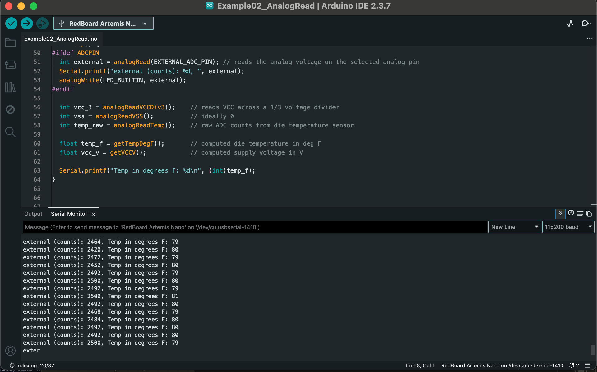
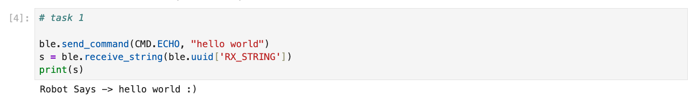
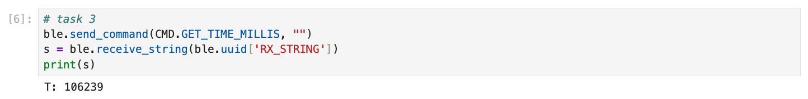
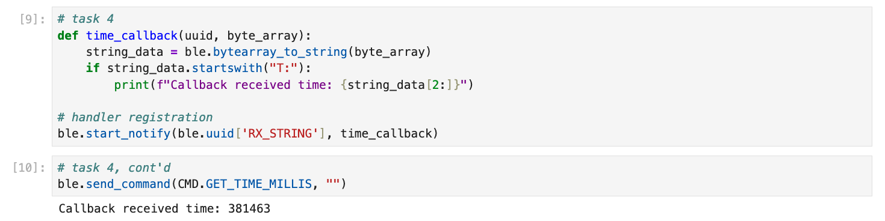
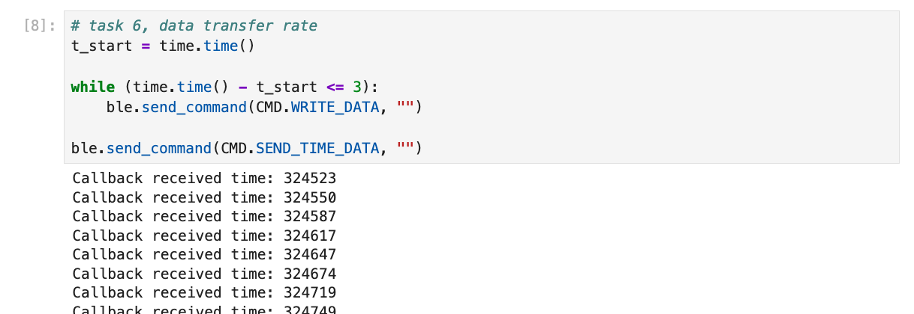
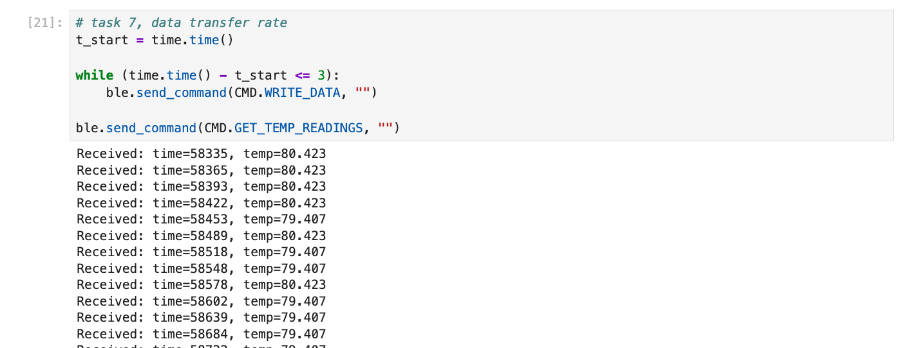
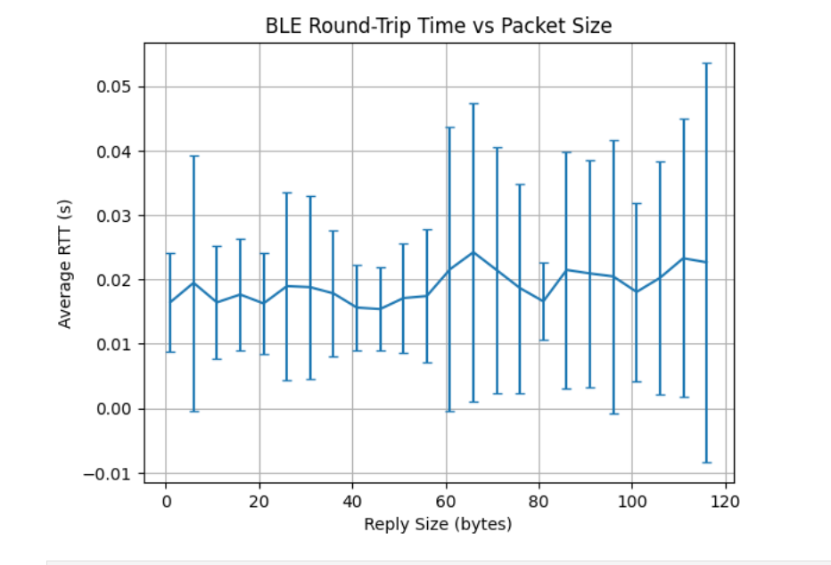

<article class="article">

# Lab 1A

## Prelab/Setup

I updated my version of ArduinoIDE and downloaded the *SparkFun Apollo3 Boards board core* definitions from the [json link](https://raw.githubusercontent.com/sparkfun/Arduino_Apollo3/main/package_sparkfun_apollo3_index.json).

## Activity
After establishing a wired connection, I verified function with the following example demos by burning the code one-by-one into the Artemis board.

### Blink Demo
`File > Examples > 01.Basics > Blink` caused the blue LED on the board to turn on for one second, then off for one second, repeatedly.
[](https://www.youtube.com/watch?v=ISIRxOvw0SA)

### Serial Echo Demo 
`File > Examples > Apollo3 > Example04_Serial` allowed the Artemis board to read input from the serial monitor in the Arduino IDE. The baudrate is set to 115200. The board then prints the user's input back out to the serial monitor, essentially echoing the input. 

[](https://www.youtube.com/watch?v=kwhDU2digjA)


### Temperature Sensor Demo 
`File > Examples > Apollo3 > Example02_AnalogRead` read in the onboard ADC (analog to digital converter) temperature data to print the raw analog values. I adjusted the demo code to display the temperature in degrees Fahrenheit. 

```
Serial.printf("Temp in degrees F: %d\n", (int)temp_f);
```




The temperature increased after touching and blowing hot air onto the chip. 


### Microphone Demo
`File > Examples > PDM > Example01_MicrophoneOutput`  demonstrated the pulse density microphone (PDM) on the Artemis board. I played the audio of a Youtube video with increasing frequency and output the corresponding value that the PDM detected to the serial monitor.
[](https://www.youtube.com/watch?v=RuEBkrkcBQA)

### Simplified Electronic Tuner (5000-Level Question)
Using three simple notes and their confirmed frequency and constructing approximate ranges, the serial monitor prints the note detected by the PDM. The note ranges are as follows:

- B4 (493.9 Hz): 491-495 Hz
- E5 (659.3 Hz): 658-663 Hz
- A5 (880.0 Hz): 878-881 Hz

[](https://www.youtube.com/watch?v=FF3fmqPSX9U )
```c
// Code Snippet from Arduino
ui32LoudestFrequency = (sampleFreq * ui32MaxIndex) / pdmDataBufferSize;

if (ui32LoudestFrequency >= 491 && ui32LoudestFrequency <= 495) {
Serial.println("Note detected: B5 (493.9 Hz)");
}
else if (ui32LoudestFrequency >= 658 && ui32LoudestFrequency <= 663)
{
Serial.println("Note detected: E5 (659.3 Hz)");
}
else if (ui32LoudestFrequency >= 878 && ui32LoudestFrequency <= 881)
{
Serial.println("Note detected: A5 (880.0 Hz)");
}

```

---

# Lab 1B: Bluetooth Low Energy (BLE)
## Prelab

### Setup

I set up and activated the virtual environment for Python. I installed required Python packages: `numpy, pyyaml, colorama, nest_asyncio, bleak, jupyterlab`.  

I then printed the MAC address of the Artemis and added it to `connections.yaml` to ensure the laptop connects to the correct board.


I generated a UUID for the bluetooth service by importing the UUID module into the Anaconda notebook and generating a random UUID using the following command:
```python
import uuid
print(uuid.uuid4())
```

### Codebase
The `connections.yaml` and `ble_arduino.ino` must be updated with the generated UUID which allows us to connect the board over Bluetooth. This is because each service and characteristic has a UUID to uniquely identify it. This ensures communication happens only between the laptop and the correct Artemis board.

The Artemis board runs `ble_arduino.ino` which sets up BLE services and characteristics to send and receive data. Python communicates with the board using `demo.ipnb` or any other notebook using functions to `send_command` to the board or `receive_string()/receive_int()/receive_float()` from the board.


## Activity

### Task 1: Echo
Command `ECHO` sends a string value from the computer to the Artemis board. Using this command, I sent a string to my Artemis, and my computer recieved and printed any augmented string based on my input.

```c
case ECHO:
    char char_arr[MAX_MSG_SIZE];
    // Extract next value from the command string as a character array
    success = robot_cmd.get_next_value(char_arr);
    if (!success)
        return;

    tx_estring_value.clear();
    tx_estring_value.append("Robot Says -> ");
    tx_estring_value.append(char_arr);
    tx_estring_value.append(" :)");

    tx_characteristic_string.writeValue(tx_estring_value.c_str());

    Serial.print("Echoed: ");
    Serial.println(tx_estring_value.c_str());

    break;
```




### Task 2: Three Floats
Command `SEND_THREE_FLOATS` receives three floats as inputs, extracts, and sends these floats to the Artemis board.

```c
case SEND_THREE_FLOATS:
    float float_a, float_b, float_c;

    success =
        robot_cmd.get_next_value(float_a) &&
        robot_cmd.get_next_value(float_b) &&
        robot_cmd.get_next_value(float_c);

    if (!success)
        return;

    Serial.print("Three Floats: ");
    Serial.print(float_a);
    Serial.print(", ");
    Serial.print(float_b);
    Serial.print(", ");
    Serial.println(float_c);

    break;
```


### Task 3: Time in Milliseconds

This added command `GET_TIME_MILLIS` outputs the current time in milliseconds since the board started to the string characteristic. This is in format “T:123456”.

```c
case GET_TIME_MILLIS:
            tx_estring_value.clear();
            tx_estring_value.append("T:");
            tx_estring_value.append((int)millis());
            tx_characteristic_string.writeValue(tx_estring_value.c_str());

            break;
```



### Task 4: Notification Handler

The notification handler in Python receives the string value (the **BLEStringCharactersitic** in Arduino) from the Artemis board. This allows the Python to retrieve data from the Artemis board whenever the board transmits data instead of only receiving data when the Python program requests it. 

The handler receives all strings, and the callback selectively prints only the time messages. In the callback `time_callback` function, it parses the time string, utilizing that the syntax of time data begins with "T:", and prints the time automatically when the robot sends them instead of manually reading the characteristic.




### Task 5: Message Transfer Rate

In this task, I ran a loop that sent the `GET_TIME_MILLIS` command over and over again for three seconds where it is received and processed by the notification handler. I then computed the data transfer rate. I used the notification handler from Task 4.

After running 
```python
ble.start_notify(ble.uuid['RX_STRING'], time_callback)
```


Message transfer rate:
86 / 3 = 28.7 messages / second


In Task 3, I cast the time value as an integer before appending it to the string. The timestamp was transmitted as an ASCII string rather than a binary integer; therefore, a value such as 123456 occupied 6 bytes, with the full message "T:123456" totaling approximately 8 bytes. The message size increases with the number of digits as `millis()` grows.

Therefore, the effective data transfer rate is as follows:
(86 x 8 bytes) /3 s = 229.3 bytes / second


### Task 6: Timestamp Array
I defined a global array where time stamps are placed into the array without exceeding the `MAX_DATA` size limit in command `WRITE_DATA`.  Then, command `SEND_TIME_DATA` loops the array and sends each data point as a string and verified all the data was sent over, assuming that the total written data did not exceed the limit.

```c
// global variables
#define MAX_DATA 100   // size of the buffer
int timestamp_array[MAX_DATA];
int data_index = 0;    // next free slot
```


```c
case WRITE_DATA:
            if (data_index < MAX_DATA) {
                timestamp_array[data_index] = (int)millis();
                data_index++;
            } 
            break;

case SEND_TIME_DATA:
            Serial.print("Number of stored timestamps: ");
            Serial.println(data_index);

            for (int i = 0; i < data_index; i++) {
                tx_estring_value.clear();
                tx_estring_value.append("t:");
                tx_estring_value.append(timestamp_array[i]);
                tx_characteristic_string.writeValue(tx_estring_value.c_str());
            }
            data_index = 0;  // reset buffer after sending

            break;
```


```python
# python
received_timestamps = []

def write_time_callback(uuid, byte_array):
    string_data = ble.bytearray_to_string(byte_array)
    if string_data.startswith("t:"):
        t = int(string_data[2:])
        received_timestamps.append(t) # adds to array
        print(f"Received timestamp: {t}")

ble.start_notify(ble.uuid['RX_STRING'], write_time_callback)
```




### Task 7: Temperature Reading
 
 I added a global array to store temperatures in Fahrenheit that is the same size as the time stamp array where each element in both arrays correspond.

 I added slight adjustments to the existing `WRITE_DATA` case to populate the temperature array.
 
 Then, I created command `GET_TEMP_READINGS` that iterates through both arrays simultaneously, sending each temperature reading alongside its corresponding time stamp. The notification handler was updated to parse these strings and populate the data into two separate lists.


```c
// global variables
#define MAX_DATA 100   // size of the buffer
int timestamp_array[MAX_DATA];
float temp_array[MAX_DATA];
int data_index = 0;    // next free slot
```

```c
case WRITE_DATA:
            if (data_index < MAX_DATA) {
                timestamp_array[data_index] = (int)millis();
                temp_array[data_index] = getTempDegF();
                data_index++;
            } 
            break;

```

```c
case GET_TEMP_READINGS:
            for (int i = 0; i < data_index; i++) {
                tx_estring_value.clear();
                tx_estring_value.append("D:");
                tx_estring_value.append(timestamp_array[i]);
                tx_estring_value.append(",");
                tx_estring_value.append(temp_array[i]);
                tx_characteristic_string.writeValue(tx_estring_value.c_str());
            }
            data_index = 0;  // reset buffer after sending
            break;
```



Message transfer rate:
95/3 = 31.7 messages / second

Therefore, the effective data transfer rate is as follows:
(95 x 8 bytes)(3 s) = 253.3 bytes / second


### Task 8 

The two methods to gather and store data is to either real-time `GET_TIME_MILLIS` or in batches with the write and send commands. 


Although method 1 (single value transfer) is slower, each measurement is transmitted as soon as it is acquired, which is useful for monitoring rapidly changing processes or for applications where immediate feedback is required. However, this method is less efficient in terms of data throughput because each message is sent individually, and the overhead of repeated communication reduces the effective data transfer rate (rate of approx 229 B/s in this case).


On the other hand, method 2 (batch collection) is much faster in terms of data throughput (approx 253 B/s) because multiple measurements are stored in memory first and then transmitted together. It has to wait until prompted or until the entire batch is collected before sending which introduces a delay between acquisition and availability of data. This is good for when the changes occur quickly in the system being monitored and sending messages one at a time would bottleneck the process. It is also useful when network bandwidth is limited, because sending fewer, larger messages is more efficient. The memory is very costly though.

The batch method can gather data at the speed limited by the microcontroller’s clock speed and memory write operations. For the Artemis board, which has 384 kB of RAM, we can calculate the approximate number of messages that can be stored in memory:
Each message is about 14 bytes with time and temperature data (format D:123456,12.423).

Available RAM: 384 kB = 384 × 1024 = 393,216 bytes.

Maximum messages that can fit in RAM theoretically:
393,216 bytes/ (12 bytes/message) = 28,086 messages

If the batch method achieves a message rate of 31.7 messages/second (rate I found in Task 7), the total recording time before memory is full is:

32,768 messages​ / (31.7 messages/s) = 886.0 seconds = 14.8 minutes

Thus, batch mode allows much faster rate for a finite time until memory fills while real-time mode is better for continuous monitoring over long periods.


## 5000-Level Questions

### Task 1 Effective Data Rate And Overhead: 

```c
case TEST_REPLY: {
    char char_arr[MAX_MSG_SIZE];

    success = robot_cmd.get_next_value(char_arr);
    if (!success)
        return;

    tx_estring_value.clear();
    tx_estring_value.append(char_arr);
    tx_characteristic_string.writeValue(
        tx_estring_value.c_str()
    );
    break;

}
```



BLE has fixed overhead per packet, so with small packets, that overhead dominates. As packets get larger, more of each transmission has better efficiency since overhead stays the same but the payload grows, so throughput rises. Overall, larger packets amortize the overhead so there is higher effective throughput.


As message size increases, the average round-trip time stays roughly constant, but the spread of response times grows. The average time to send a 5-byte message as it does a 120-byte message is approximately the same but with variability increasing as packet size increases. 

Each small message still incurs fixed protocol overhead that is paid for every message. 


Packet size does not strongly affect average latency, but larger packets introduce more timing variability. This is because larger messages are more likely to be affected by packet handling and undergo interference. This can cause occasional long delays which increases variability even though the average remains similar. 

### Task 2 

As the data transmission rate from the robot (Artemis board) to the computer increases, reliability begins worsen. At lower data rates, the computer is able to read all published data without missing packets, because each message can be transmitted, acknowledged, and processed within a single BLE connection interval.

High frequency BLE notifications often cause dropped messages because the it may exceed BLE bandwidth limits or buffers can overflow. This causes dropped packets, so adding small delays improves reliability.


# Discussion 

Notably, I initially ran into issues as the demo categories `File > Examples > Apollo3` and `File > Examples > PDM` were not present on my machine. I tried redownloading both the json packages and the ArduinoIDE software with no success. After restarting my machine, these example groups appeared. 

Overall, this lab was helpful in gaining a foundational understanding of BLE and how to establish a wireless communication link between the Artemis board and a laptop to enable commands, data transfer, and notifications. The BLE portion highlighted the tradeoffs between real-time streaming and batch data transfer. 
 


# Collaboration 

I referenced Aidan McNay's structure for how to approach the batch implementation and Lucca Correia on the initial steps of the RAM calculation in Task 8.
