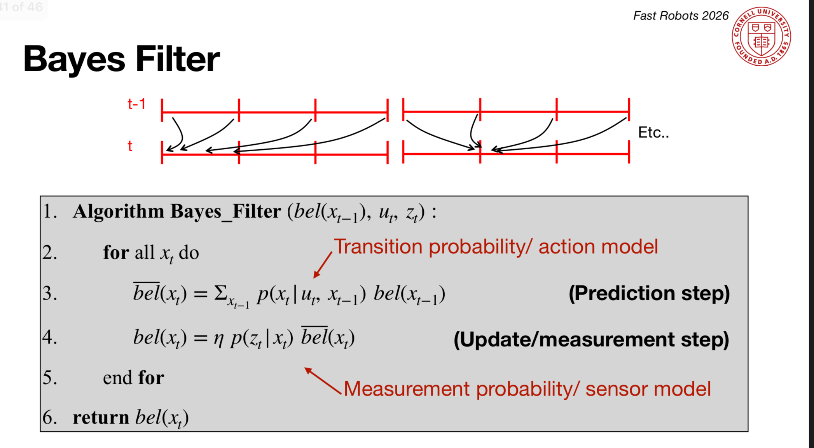
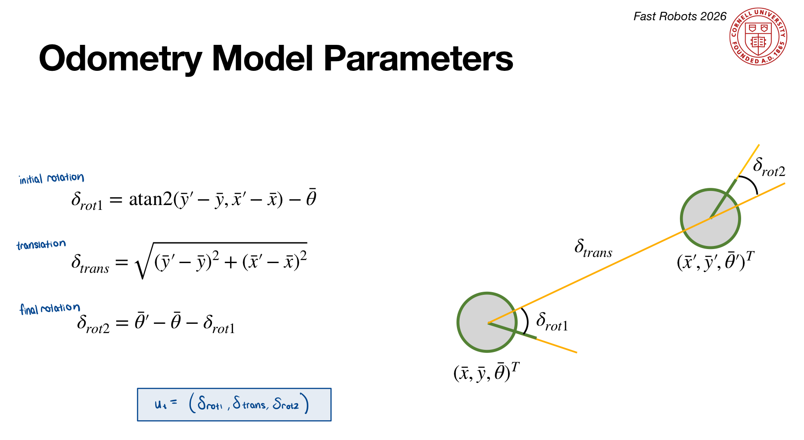

<article class="article">

The robot's 3D state space (x, y, θ) spanning [-1.6764, 1.9812) m × [-1.3716, 1.3716) m × [-180, 180) is discretized into a 12 × 9 × 18 grid (1944 cells). Each cell stores the probability that the robot occupies that pose. The Bayes Filter alternates between a prediction step (which spreads belief forward using the odometry motion model) and an update step (which decreased uncertainty inthe belief using ToF sensor measurements).

Instead of relying on noisy odometry alone, the Bayes filter maintains a probabilistic belief over the robot's pose that is updated iteratively with both motion and sensor data.

The pseudocode for the algorithm is as follows (from Lecture 17, slide 41):



## Implementation

### Compute Control
`compute_control` decomposes the movement between two odometry poses into (δ_rot1, δ_trans, δ_rot2). Both rotations are passed through `mapper.normalize_angle` to keep them in [-180°, 180°]. 



```python
def compute_control(cur_pose, prev_pose):
  """ Given the current and previous odometry poses, this function extracts
  the control information based on the odometry motion model.

  Args:
      cur_pose  ([Pose]): Current Pose
      prev_pose ([Pose]): Previous Pose 

  Returns:
      [delta_rot_1]: Rotation 1  (degrees)
      [delta_trans]: Translation (meters)
      [delta_rot_2]: Rotation 2  (degrees)
  """
  x_prev, y_prev, theta_prev = prev_pose
  x_cur, y_cur, theta_cur = cur_pose

  dx = x_cur - x_prev
  dy = y_cur - y_prev

  delta_rot_1 = mapper.normalize_angle(np.degrees(np.arctan2(dy, dx)) - theta_prev)
  delta_trans  = np.sqrt(dx**2 + dy**2)
  delta_rot_2  = mapper.normalize_angle(theta_cur - theta_prev - delta_rot_1)

  return delta_rot_1, delta_trans, delta_rot_2
```


### Odometry Motion Model
`odom_motion_model` uses `compute_control` to find the implied motion between a candidate previous and current pose, then evaluates how likely that motion is given the actual odometry reading u via three independent Gaussians (one per motion component). The product of the three gives the transition probability $p(x_t | u_t, x_{t-1})$.

```python
def odom_motion_model(cur_pose, prev_pose, u):
  """ Odometry Motion Model

  Args:
      cur_pose  ([Pose]): Current Pose
      prev_pose ([Pose]): Previous Pose
      (rot1, trans, rot2) (float, float, float): A tuple with control data in the format 
                                                  format (rot1, trans, rot2) with units (degrees, meters, degrees)


  Returns:
      prob [float]: Probability p(x'|x, u)
  """
  delta_rot_1, delta_trans, delta_rot_2 = compute_control(cur_pose, prev_pose)

  prob_rot_1 = loc.gaussian(delta_rot_1, u[0], loc.odom_rot_sigma)
  prob_trans  = loc.gaussian(delta_trans,  u[1], loc.odom_trans_sigma)
  prob_rot_2  = loc.gaussian(delta_rot_2,  u[2], loc.odom_rot_sigma)

  prob = prob_rot_1 * prob_trans * prob_rot_2

  return prob
```

### Prediction Step
`prediction_step` implements the prediction equation by iterating over all previous cells and accumulating their contributions to each possible current cell weighted by the transition probability. Cells with prior belief below 0.0001 are skipped. The resulting `bel_bar` is normalized.

```python
def prediction_step(cur_odom, prev_odom):
  """ Prediction step of the Bayes Filter.
  Update the probabilities in loc.bel_bar based on loc.bel from the previous time step and the odometry motion model.

  Args:
      cur_odom  ([Pose]): Current Pose
      prev_odom ([Pose]): Previous Pose
  """

  u = compute_control(cur_odom, prev_odom)
  loc.bel_bar = np.zeros((mapper.MAX_CELLS_X, mapper.MAX_CELLS_Y, mapper.MAX_CELLS_A))

  for px in range(mapper.MAX_CELLS_X):
    for py in range(mapper.MAX_CELLS_Y):
      for pa in range(mapper.MAX_CELLS_A):
          bel_prev = loc.bel[px, py, pa]
          if bel_prev < 0.0001:
              continue
          prev_pose = mapper.from_map(px, py, pa)
        for cx in range(mapper.MAX_CELLS_X):
          for cy in range(mapper.MAX_CELLS_Y):
            for ca in range(mapper.MAX_CELLS_A):
                cur_pose = mapper.from_map(cx, cy, ca)
                prob = odom_motion_model(cur_pose, prev_pose, u)
                loc.bel_bar[cx, cy, ca] += prob * bel_prev

  loc.bel_bar /= np.sum(loc.bel_bar)
```


### Sensor Model
`sensor_model` compares the 18 true range observations for a given cell against the robot's actual ToF readings using a Gaussian noise model, returning an array of 18 per-reading likelihoods.

```python 
def sensor_model(obs):
  """ This is the equivalent of p(z|x).


  Args:
      obs ([ndarray]): A 1D array consisting of the true observations for a specific robot pose in the map 

  Returns:
      [ndarray]: Returns a 1D array of size 18 (=loc.OBS_PER_CELL) with the likelihoods of each individual sensor measurement
  """
  prob_array = loc.gaussian(obs, loc.obs_range_data.flatten(), loc.sensor_sigma)

  return prob_array
```

### Update Step
`update_step` loops over all current cells, computes the product of the 18 sensor likelihoods via `np.prod(sensor_model(...))`, multiplies by `bel_bar`, and normalizes to produce the updated belief bel.

```python 
def update_step():
  """ Update step of the Bayes Filter.
  Update the probabilities in loc.bel based on loc.bel_bar and the sensor model.
  """
  range_data = loc.obs_range_data.flatten()
  for (x, y, a), bel_bar in np.ndenumerate(loc.bel_bar):
    true_obs = mapper.get_views(x, y, a)
    prob_array = loc.gaussian(true_obs, range_data, loc.sensor_sigma)
    loc.bel[x, y, a] = np.prod(prob_array) * bel_bar

  loc.bel /= np.sum(loc.bel)

```

## Running the Bayes Filter in Simulation
The blue Bayes-filtered trajectory closely tracks the green ground truth throughout the run, while the red odometry path drifts a lot. The inaccuracy of the odometry model is highlighted in the video as it has a non-reliable trajectory. Belief probabilities near 1.0 indicate high-confidence localization at most steps. 

The Bayes filter perform sbetter when the robot is near walls. This is because the sensor data being more trustworthy and consistent when it is closer to the walls, and less trustworthy in larger open spaces, which cause larger errors (refer to .txt files). In open spaces, like the center of the map, multiple grid cells share similar expected sensor profiles, causing the belief to spread and confidence to drop slightly.

Even with independently noisy motion and sensor models, the robot's combined belief converges reliably to a good estimate of true position.

[](https://www.youtube.com/watch?v=UjsU6BwNwlE)


[](https://www.youtube.com/watch?v=Queb0bPepys)


The raw data for both runs can be downloaded here:
[Run 1 CSV](../../../public/fast-robots/lab10/lab10_run1.csv) | [Run 2 CSV](../../../public/fast-robots/lab10/lab10_run2.csv)
Note that the ground truth θ is cumulative/unwrapped from the simulator. The belief θ is normalized to [-180°, 180°).

### Run 1 Results

| Step | GT (x, y, θ) | Belief (x, y, θ) | Prob | Err x | Err y |
|------|--------------|------------------|------|-------|-------|
| 0  | (0.251, -0.069, -37.6°)  | (0.305, 0.000, -50°)   | 1.0       | -0.054 | -0.069 |
| 1  | (0.572, -0.430, 311.7°)  | (0.610, -0.610, -50°)  | 1.0       | -0.038 |  0.179 |
| 2  | (0.578, -0.437, 660.6°)  | (0.610, -0.305, -50°)  | 1.0       | -0.032 | -0.132 |
| 3  | (0.749, -0.730, 1020.2°) | (0.610, -0.914, -70°)  | 0.9994    |  0.139 |  0.184 |
| 4  | (0.946, -0.801, 1450.4°) | (0.610, -0.914, -10°)  | 1.0       |  0.337 |  0.114 |
| 5  | (1.694, -0.515, 1858.7°) | (1.524, -0.610, 50°)   | 1.0       |  0.170 |  0.094 |
| 6  | (1.726, -0.197, 2244.2°) | (1.829, -0.305, 90°)   | 1.0       | -0.103 |  0.108 |
| 7  | (1.759,  0.126, 2608.3°) | (1.829,  0.000, 90°)   | 1.0       | -0.070 |  0.126 |
| 8  | (1.736,  0.467, 2990.7°) | (1.829,  0.610, 110°)  | 1.0       | -0.092 | -0.143 |
| 9  | (1.721,  0.637, 3388.7°) | (1.829,  0.610, 150°)  | 1.0       | -0.108 |  0.027 |
| 10 | (1.359,  0.825, 3759.9°) | (1.219,  0.914, 170°)  | 1.0       |  0.140 | -0.089 |
| 11 | (0.866,  0.779, 4213.0°) | (0.914,  0.914, -90°)  | 1.0       | -0.048 | -0.136 |
| 12 | (0.734,  0.612, 4627.7°) | (0.610,  0.610, -50°)  | 1.0       |  0.125 |  0.002 |
| 13 | (0.658,  0.582, 4976.5°) | (0.610,  0.610, -50°)  | 1.0       |  0.048 | -0.028 |
| 14 | (0.660,  0.181, 5316.0°) | (0.610,  0.305, -90°)  | 1.0       |  0.050 | -0.123 |
| 15 | (-0.115, -0.345, 5652.6°)| (0.000, -0.305, -110°) | 1.0       | -0.115 | -0.040 |

### Run 2 Results

| Step | GT (x, y, θ) | Belief (x, y, θ) | Prob | Err x | Err y |
|------|--------------|------------------|------|-------|-------|
| 0  | (0.278, -0.082, -38.9°)  | (0.305,  0.000, -50°)  | 1.0       | -0.026 | -0.082 |
| 1  | (0.497, -0.503, 297.5°)  | (0.305, -0.610, -70°)  | 1.0       |  0.192 |  0.107 |
| 2  | (0.509, -0.525, 645.2°)  | (0.610, -0.610, -70°)  | 1.0       | -0.101 |  0.084 |
| 3  | (0.601, -0.894, 1004.1°) | (0.610, -0.914, -70°)  | 1.0       | -0.008 |  0.021 |
| 4  | (0.789, -0.975, 1439.0°) | (0.914, -0.914, 10°)   | 1.0       | -0.125 | -0.061 |
| 5  | (1.447, -0.830, 1849.9°) | (1.524, -0.914, 50°)   | 1.0       | -0.077 |  0.084 |
| 6  | (1.541, -0.456, 2235.9°) | (1.829, -0.305, 90°)   | 1.0       | -0.287 | -0.151 |
| 7  | (1.631, -0.099, 2599.8°) | (1.829, -0.305, 70°)   | 1.0       | -0.198 |  0.205 |
| 8  | (1.665,  0.333, 2977.8°) | (1.524,  0.305, 90°)   | 0.9998    |  0.141 |  0.028 |
| 9  | (1.690,  0.535, 3381.2°) | (1.524,  0.610, 150°)  | 1.0       |  0.166 | -0.075 |
| 10 | (1.353,  0.806, 3752.3°) | (1.524,  0.610, 150°)  | 1.0       | -0.171 |  0.197 |
| 11 | (0.828,  0.824, 4202.2°) | (0.914,  0.914, -110°) | 1.0       | -0.087 | -0.090 |
| 12 | (0.623,  0.394, 4605.0°) | (0.610,  0.305, -70°)  | 0.5192    |  0.013 |  0.089 |
| 13 | (-0.013,  0.006, 4908.1°)| (0.000,  0.000, -130°) | 1.0       | -0.013 |  0.006 |
| 14 | (-0.284, -0.163, 5257.1°)| (-0.305,  0.000, -150°)| 0.6374    |  0.020 | -0.163 |
| 15 | (-0.543, -0.227, 5599.8°)| (-0.610, -0.305, -170°)| 1.0       |  0.067 |  0.077 |


## Acknowledgments

I referred to Lucca Correial and Adian McNay's lab reports from Spring 2025.