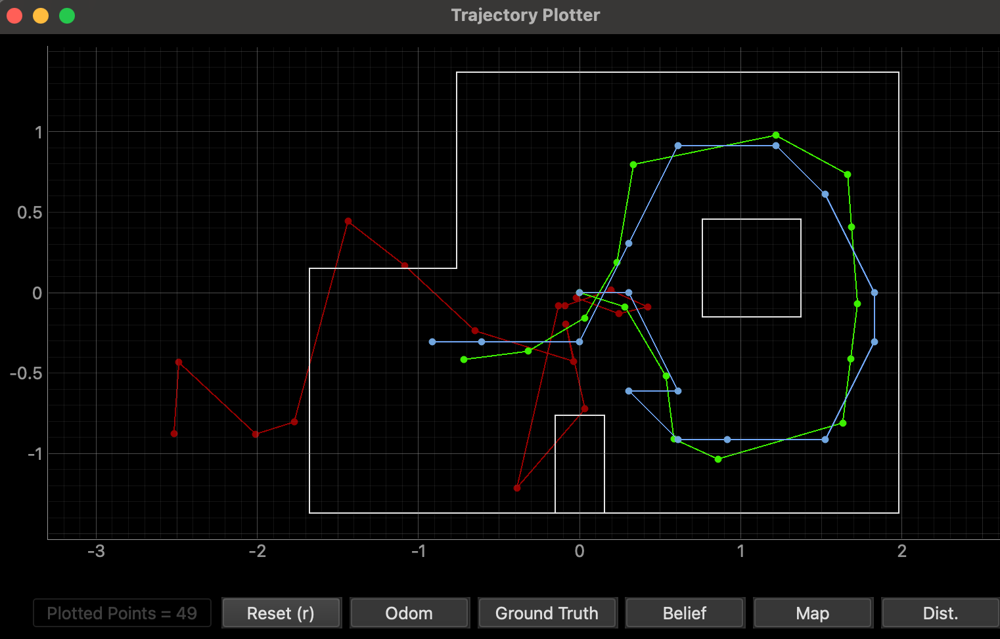
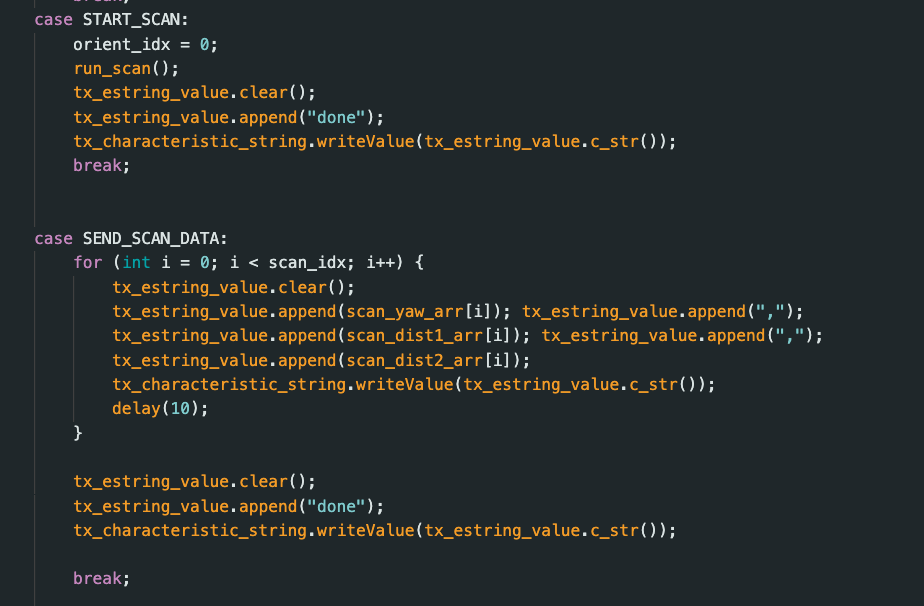
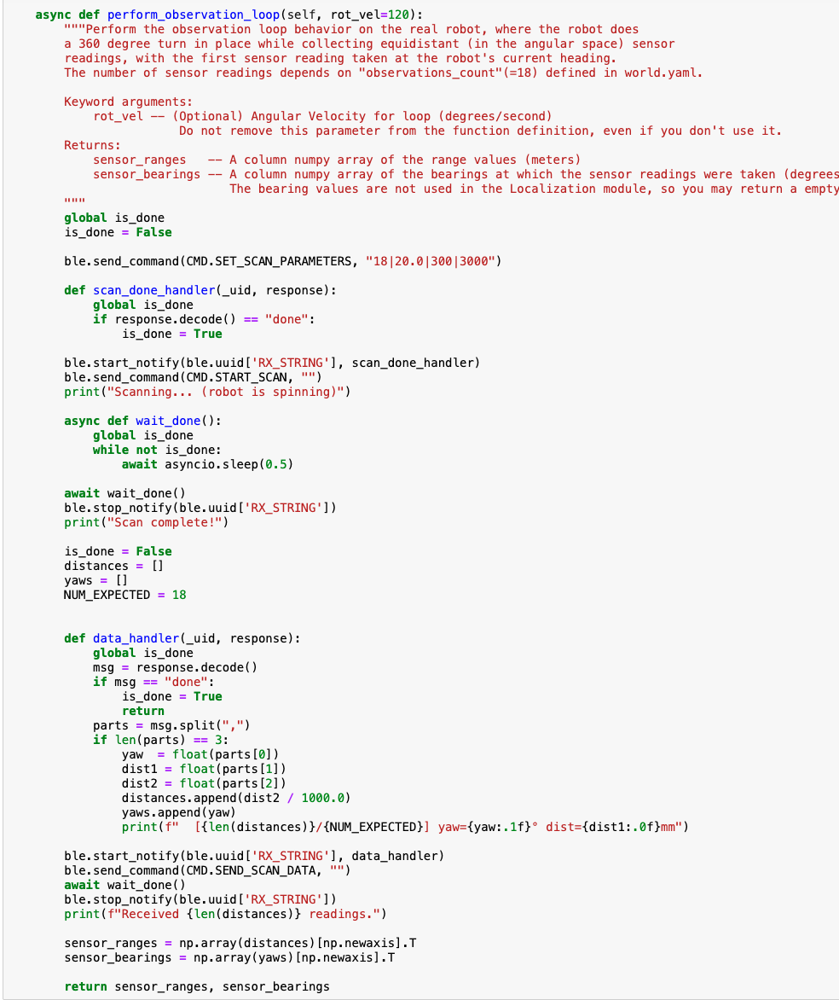
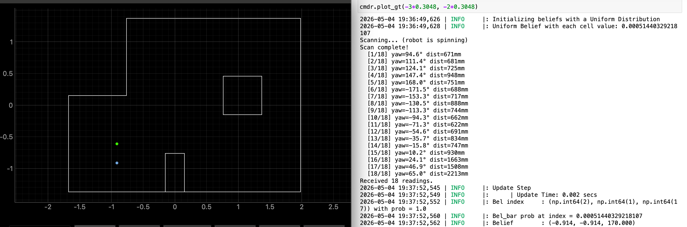
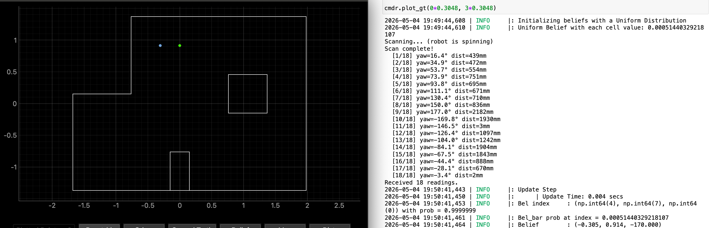
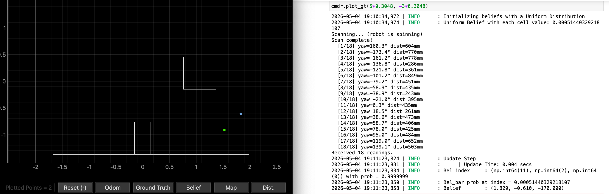
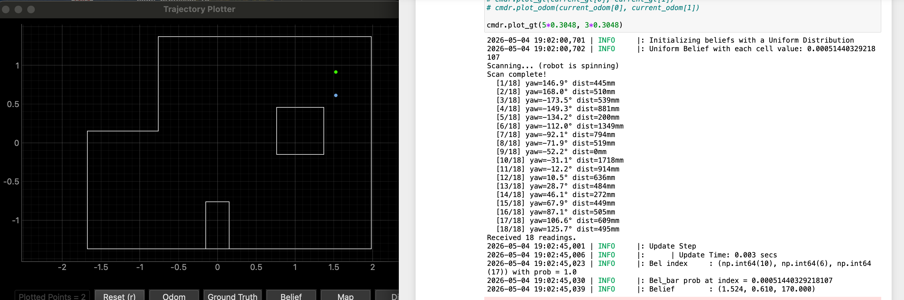

<article class="article">

## Localization in Simulation

Before deploying on the real robot, I ran the notebook `lab11_sim.ipynb` and verified that the same localization results was found in lab 10.  The virtual robot successfully localized after a single 360 degree observation loop. This is shown in the screenshot of the final plot (red odom, green ground truth and blue belief ) below.

## Real Robot Implementation

I mostly reused the scanning code from previous labs (e.g. lab 9 and 10). The only change I made was slightly adjusting the scanning commands to support a `done` flags in commands `START_SCAN` and `SEND_SCAN_DATA` so Python knows when to proceed to the next step.

I implemented the member function  `perform_observation_loop` of class RealRobot that performs the observation loop behavior on the real robot and return two column numpy arrays: ToF range values in meters and sensor bearings in degrees. Note that I had a preexisting `SEND_SCAN_PARAMETERS` that takes in number steps, degrees of a turn step, settle in ms, and the timeout time in ms. 

## Real Robot Localization Results
I then placed my car at each of the four marked poses (facing 0 degrees): (-3, 2), (0, 3), (5, -3), and (5,3). I then run only the update step with a uniform priot using the sensor measurement data to localize the robot, and then recorded the belief state.

| Pose (ft, ft, deg) | Ground Truth (m) | Belief (m) | Error (m) | Probability |
|-----------|------------------|------------|-----------|-------------|
| (-3, -2, 0°) | (-0.914, -0.610, 0°) | (-0.914, -0.914, 170°) | (0.000, -0.3044) | 1.0 |
| (0, 3, 0°) | (0.000, 0.914, 0°) | (-0.305, 0.914, -170°) | (-0.305, 0.000) | 0.9999999 |
| (5, -3, 0°) | (1.524, -0.914, 0°) | (1.829, -0.610, -170°) | (0.305, -0.3044) | 0.9999999 |
| (5, 3, 0°) | (1.524, 0.914, 0°) | (1.524, 0.610, 170°) | (0.000, 0.3044) | 1.0 |

Video of the robot performing localization for two of the poses is as follows:

The true position of the robot is the green dot while the belief based on localization is the blue dot.

### Pose (-3 ft, -2 ft, 0 deg)

The robot localized perfectly in x but showed y-error of 0.3044 m  (0.6096 m expected; -0.914 m real). This corner position has distinctive sensor readings from the nearby walls, resulting in high confidence (prob = 1.0).

### Pose (0 ft, 3 ft, 0 deg)

The robot localized showed an x-error of 0.305 m (0 m expected; -0.305 m real) but localized perfectly in y. This position near the top wall provided strong sensor readings in the y-direction.

### Pose (5 ft, -3 ft,0 deg)

This was the worst performance out of all the poses. The robot showed both an x-error of 0.305 m (1.524 m expected; 1.829 m real) and 0.3044 m y-error (0.9144 m expected; 0.610 m real). 

### Pose (5 ft,3 ft, 0 deg)

The robot had perfect x-localization with 0.3044 m y-error (0.9144 m expected; 0.610 m real). The top-right corner's asymmetriy allowed the filter to resolve its position with high confidence.

## Discussion
The Bayes filter achieved pretty good results at all four tested positions, with belief probabilities at or near 1.0 in every case. 

The robot performed localization at similar success at all poses since the corner and near-wall positions used in this lab provide the ideal conditions for ToF-based localization. Each 18-reading scan produces unique readings that strongly constrains which grid cell matches. Also, ToF sensors are most accurate at range <4 m (refer to lab 3 for the long mode specifications), and all test positions were within 1-2 m of at least one wall. 

However, when errors did exist, I found that errors were always of approximately 0.3044 m or 0.305 m (exactly one grid cell). This is mostly likely due to grid discretization (any ground truth position between grid centers will snap to the nearest cell) since the error values are consistent. Other possibilties are robot placement uncertainty or the natural movement (robot would occasionally move over the course of its 360 spin).

Also to note, the belief angles show values of |170 degrees| instead of 0. This is a result of the 20 deg resolution (18 cells x 20 deg = 360 deg) where the robot is within one grid cell of true 0 degrees, with the discretization causing it to snap to the neighboring cell or when it did not do a perfect 360 turn.

Although the robot performed well at these poses in the lab, I think localization would perform poorly in more ambigupus poses, like open range regions (far from walls) or symmetric positions.

## Acknowledgements
I referred to Lucca Correia and Adian McNay's lab reports from Spring 2025. I also used ChatGPT for formatting.