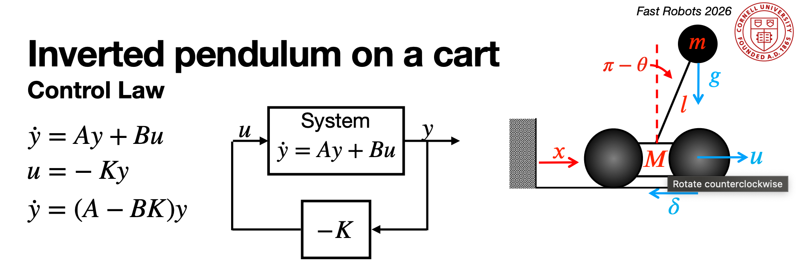
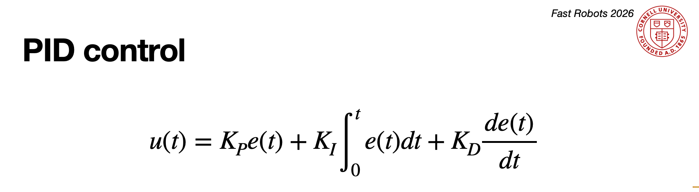

<article class="article">

## Task at Hand

Wooo! Last lab. I chose to attempt the inverted pendulum controller to balance a two-wheeled robot in an upright position. However, I failed on my own with the PID controller and then joined and collaborated with Dyllan and Shao.

Originally, on my own while deciding how to implement it, I debated between whether to start the car in the upright position and build a closed loop controller that stabilizes the car around this stable point or to start the car in the normal position, drive forward at speed and rapidly brake, and then execute the inverted pendulum trick. 

Since the method of starting in the upright position and balancing gets pipelined into a flip, I decided to implement by starting the car in an upright position. This approach simplifies the initial implementation and allows for more controlled testing of the balance controller before attempting dynamic maneuvers. If I had more time, I could have integrated the driving forward and braking approach to make the stunt more impressive.

Luckily, Dyllan and Shae also had the same idea.


## System Design Overview

The control system is paced by the DMP FIFO refresh rate. The system consists of three main components: sensing (DMP quaternion-based pitch estimation), control (mutual exclusive implementation of LQR and PID balance controllers), and actuation (motor control).

The code implements the balance controller both a PID and LQR way that can be selected via Bluetooth commands and same data-sending array format.

### DMP Choice
The system exclusively uses the DMP quaternion output for pitch angle measurement rather than raw accelerometer readings. This choice was validated in Lab 6, where we demonstrated that DMP quaternions provide lower noise and produce smoother angle estimates than raw accelerometer calculations. 

## Controller Implementation
Before running a controller, we found the balance point throught the `SEND_PITCH` command and send it back through `LQ_SETPOINT`.

```c
case SEND_PITCH: {
  // average 20 samples
  const int N = 20;
  float pitch_sum = 0.0f;
  while (collected < N) {
    if (get_DMP_data()) {
      pitch_sum += (float)pitch;
      collected++;
    }
  }
  float pitch_avg = pitch_sum / collected;
  tx_estring_value.clear();
  tx_estring_value.append("P:");
  tx_estring_value.append(pitch_avg);
  tx_estring_value.append(" N:");
  tx_estring_value.append(collected);
  tx_characteristic_string.writeValue(tx_estring_value.c_str());
  break;
}

...
case LQR_SETPOINT: {
    float theta_bal;
    robot_cmd.get_next_value(theta_bal);
    lqr_balance.theta_balance_deg = theta_bal;
    tx_estring_value.clear();
    tx_estring_value.append("LQR setpoint theta=");
    tx_estring_value.append(theta_bal);
    tx_characteristic_string.writeValue(tx_estring_value.c_str());
    break;
}

```

Each controller has their own individual start and stop command.

```c
case LQR_START:
{
    // stop pid if running
    if (pid_balance_active) {
        pid_balance_active = false;
        stopMotors();
    }

    // skipped here: retrieve lqr_timeout_us or assign default

    // reset state
    lqr_balance.reset();
    lqr_last_pwm = 0;
    lqr_arr_index = 0;

    // get fresh dmp sample
    float seed_pitch = lqr_balance.theta_balance_deg;
    {
        long t0 = micros();
        while ((micros() - t0) < 100000) {  // up to 100 ms
            if (get_DMP_data()) {
                seed_pitch = (float)pitch; 
                break;
            }
        }
    }

}

```

The PID startup follows an identical structure to ensure consistent initialization between both controllers.


### LQR Controller

The LQR (Linear Quadratic Regulator) controller implements a full-state feedback law where the state vector y = [x, θ, θ̇]ᵀ is velocity, pitch angle error, and angular velocity from gyroscope, respectively. The LQR control law is u in Lecture 11:



The main control loop reads fresh DMP data, computes the control output, and drives the motors.

```c
if (lqr_balance_active) {
  bool timed_out = (micros() - lqr_start_time) > lqr_timeout_us;

  bool dmp_ok = get_DMP_data();   // updates global `pitch` and `prev_pitch`
  if (dmp_ok) {
      // read pitch rate from gyroscope for damping term
      float theta_dot = 0.0f;
      if (update_imu()) {
          theta_dot = myICM.gyrY();
      } else {
          dt_imu = (micros() - previousMicrosIMU) / 1000000.0f;
          if (dt_imu > 0.001f) {
              theta_dot = (float)(pitch - prev_pitch) / dt_imu;
          }
      }

      // compute lqr control output
      int u_pwm = lqr_balance.compute((float)pitch, theta_dot, lqr_last_pwm);

      if (lqr_balance.tipped_over || timed_out) {
          stopMotors();
          lqr_balance_active = false;
          lqr_last_pwm = 0;
      } else {
          // Pure forward/back drive
          driveCombined(u_pwm, 0);
          lqr_last_pwm = u_pwm;
      }

      // log data
  }
```

Our final gains were
- K_ẋ = 0 (velocity feedback disabled)
- K_θ = 41.67 (proportional gain on angle error)
- K_θ̇ = 0.693 (derivative gain on angular velocity)

[](https://www.youtube.com/watch?v=Um7YjkVdBFg)


### PID Controller

The PID controller provides an alternative control approach. The PID loop structure is similar to LQR but with the addition of wrap-aware error calculation.

The control law is as follows where e = θ_setpoint - θ_measured:



```c
else if (pid_balance_active) {

    if (get_DMP_data()) {
        float theta_dot = 0.0f;
        if (update_imu()) {
            theta_dot = myICM.gyrY();
        }

        // Wrap-aware error in [-180, 180]
        float theta_err = lqr_balance.theta_balance_deg - (float)pitch;
        while (theta_err <= -180.0f) theta_err += 360.0f;
        while (theta_err >   180.0f) theta_err -= 360.0f;

        // Don't drive until brought near balance
        if (!pid_balance_engaged) {
            if (fabs(theta_err) < PID_BAL_ENGAGE_THRESHOLD_DEG) {
                pid_balance_engaged = true;
            }
        }

        // skipped here: tipover logic only fires once engaged

        if (pid_balance_tipped_over || timed_out) {
            stopMotors();
            pid_balance_active = false;
            pid_balance_last_pwm = 0;
        } else if (pid_balance_engaged) {
            // run PID
            float u_raw = pid_balance.compute((float)pitch);
            int u_pwm = (int)constrain(u_raw, -(float)PID_BAL_PWM_MAX, (float)PID_BAL_PWM_MAX);
            driveCombined(u_pwm, 0);
            pid_balance_last_pwm = u_pwm;
        } else {
            pid_balance_last_pwm = 0;
        }

        // skipped here: log data
    }
}
```


[](https://www.youtube.com/watch?v=1EHHk1WEr6w)


## Discussion
Most of our lab time was spent iteratively tuning gains. We recorded numerous videos testing different parameter combinations, ultimately converging on the final LQR gains: K_ẋ = 0, K_θ = 41.67, K_θ̇ = 0.693. The relatively high proportional gain (41.67) was to generate corrective torque, while the derivative gain (0.693) was for damping to prevent oscillation.

The LQR's full-state feedback naturally enables position control through velocity estimation (K_ẋ), but requires accurate PWM-to-velocity modeling. It performed better than the PID, balancing for longer. The PID's direct gyroscope measurement is simpler to tune and more robust, but lacks inherent position control. PID's intuitive gain adjustment (Kp for speed, Kd for damping) made initial tuning faster.


## Acknowledgements

I thank Dyllan Hofflich and Shao Stassen for their collaboration. I think Ananya for her car (RIP Dyllan's second car). We also credit Claude for help implementing logic, and I think Claude for help formatting.

Finally, I thank all of the course staff for a great semester in this class! I had a great time!


