<article class="article">


## IMU Setup


In `Files > Examples > Sparkfun IMU - ICM-20948 > Arduino > Example1_Basics`:

```c
// The value of the last bit of the I2C address.
// On the SparkFun 9DoF IMU breakout the default is 1, and when the ADR jumper is closed the value becomes 0
#define AD0_VAL 1
```

This is the last bit of the I2C address for the IMU. This bit can be jumped on the IMU breakout board to change its value to allow for multiple IMUs on the same I2C bus.

Since we are using one IMU (ADR jumper open), the default value of 1 is used. 


I added a visual indication board to show when the board was running.

[](https://www.youtube.com/watch?v=eCqG-ghZ77A )

---
## Accelerometer

The acceleration data showed the magnitude of acceleration in each direction.

Depending on its orientation, the corresponding axis reflects the Earth’s gravitational pull in a given direction (~1000).

 
```c
float pitch = atan2(myICM.accX(), myICM.accZ()) * 180 / M_PI; 
float roll  = atan2(myICM.accY(), myICM.accZ()) * 180 / M_PI; 
```

To convert the accelerometer data into to pitch $\theta$ and roll $\phi$, I used trigonometric relationships and then converted from radians to degrees. The expected outputs of approximately −90°, 0°, and +90° were observed when the sensor was aligned with gravity along each axis. 

Although variation of +- 1 was present, the values remained close to −90°, 0°, and +90° for the pitch and roll, so I did not perform two-point calibration.
 <!-- motivating a two-point calibration to improve accuracy. -->

[](https://www.youtube.com/watch?v=32xZrErMBqc )


### Lowpass Filter on Accelerometer Data
To choose the parameters for my low-pass filters, I used

\[
\alpha = \frac{T}{T + RC}
\]

\[
f_c = \frac{1}{2\pi RC}
\]

where
- $T$ is the sampling period (i.e., the time interval between successive samples),
- $R$ and $C$ are the resistor and capacitor values of the RC filter,
- $f_c$ is the desired cutoff frequency of the low-pass filter,
- $\alpha$ is the filter coefficient u


By selecting $R$ and $C$ to achieve the desired $f_c$, and knowing the sampling period $T$, $\alpha$ is found to implement the filter digitally. As discussed in lecture, the value of $\alpha$ determines whether we analyze the raw accelerometer data or its filtered version. A smaller $\alpha$ indicates we rely more on the filtered data while a larger $\alpha$ indicates we rely on the raw data (faster to retrieve). 


```python
def lowpass_filter(signal, time, fc):
    filtered = np.zeros_like(signal)
    filtered[0] = signal[0]

    for i in range(1, len(signal)):
        dt = time[i] - time[i-1]

        RC = 1/(2*np.pi*fc)
        alpha = dt/(dt + RC)

        filtered[i] = alpha*signal[i] + (1-alpha)*filtered[i-1]

    return filtered
```

### Noise Conditions

Stationary IMU readings and FFT in both the time and frequency domains:
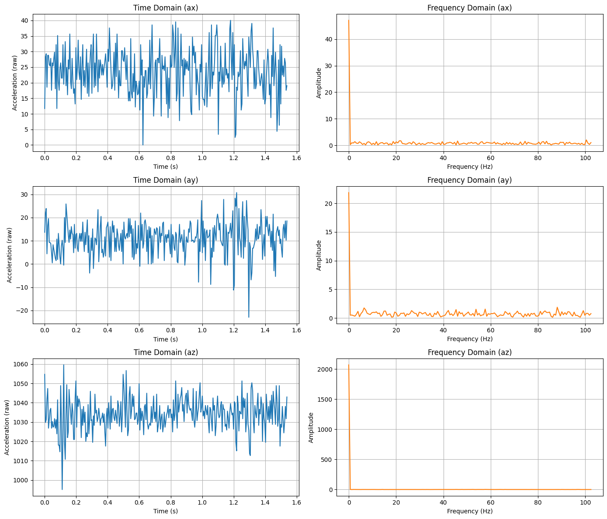


The FFT of the accelerometer data during a stationary IMU shows that most signal energy lies below 3 Hz with a dominant DC component due to gravity.  Based on this analysis, a low-pass cutoff frequency of 5 Hz was selected. This preserves general shape while removing the high-frequency noise. 

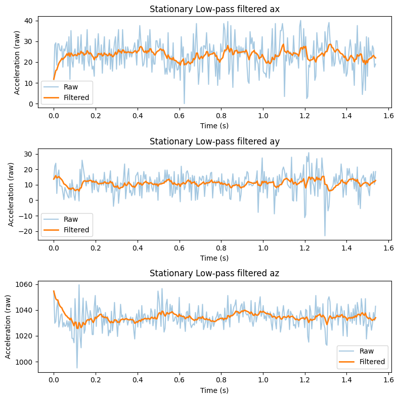

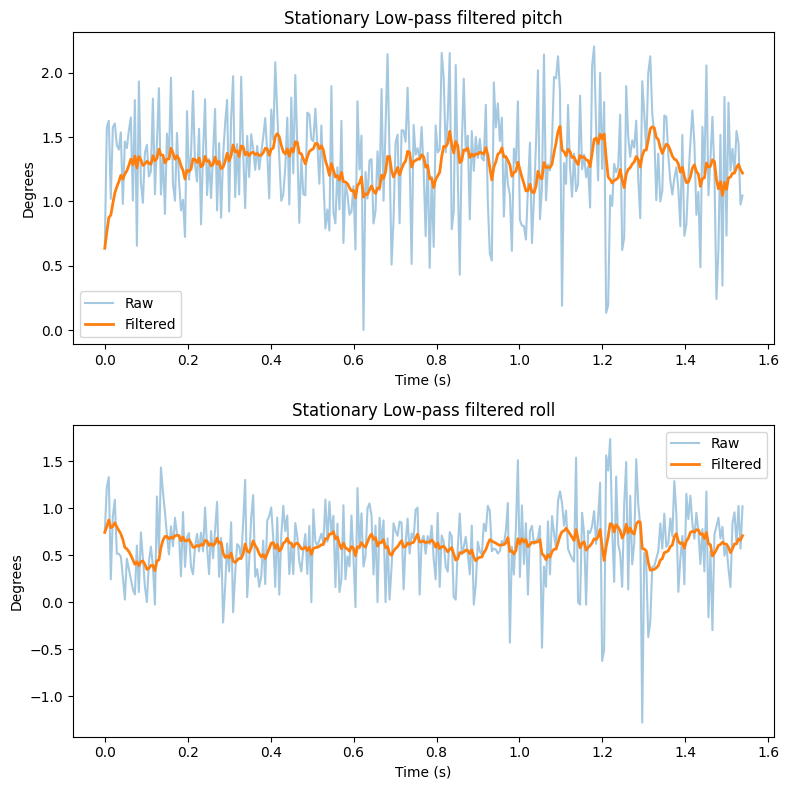

The lowpass filter significantly reduces the noise in the data, for both the raw readings of accelerations and on the pitch and roll.

We perform the same procedure on two different noisy conditions: when running the RC and tapping on the table.

#### RC Car Noise on IMU

Performing a similar analysis as the stationary IMU: similarly, a low-pass cutoff frequency of 5 Hz was selected to reduce high-frequency noise from rapid vibrations and sensor noisewhile preserving the shape.
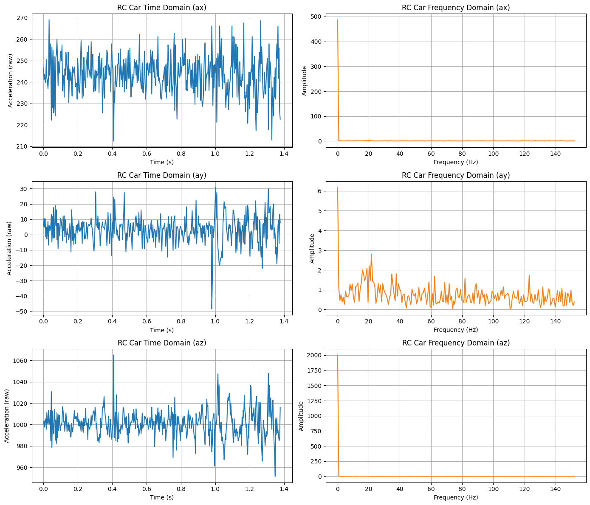
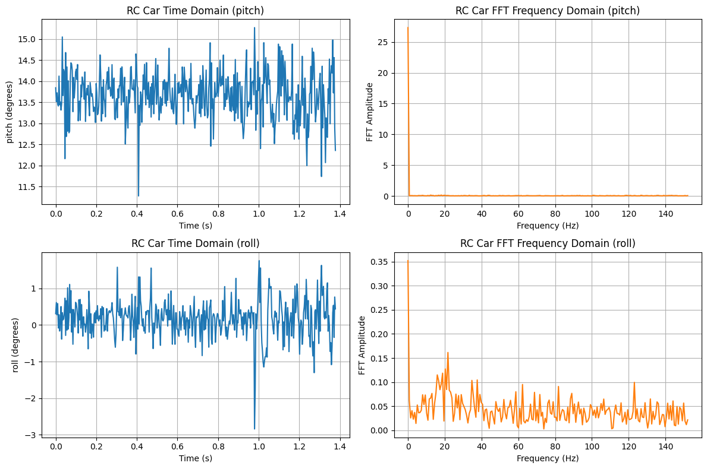

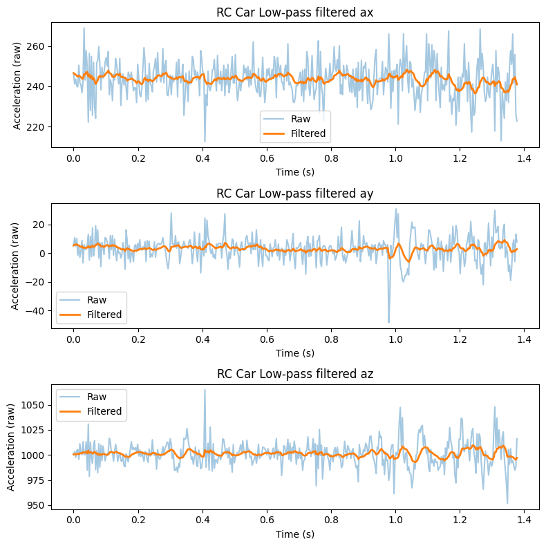
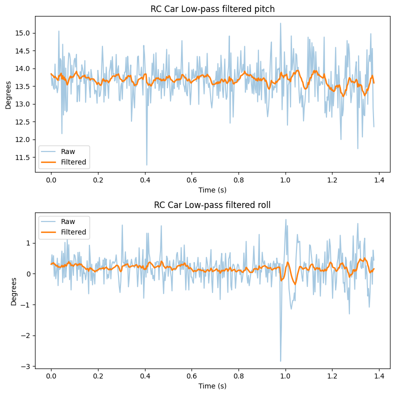

#### Tapping Vibrations on IMU
Similarly, a low-pass cutoff frequency of 5 Hz was selected.
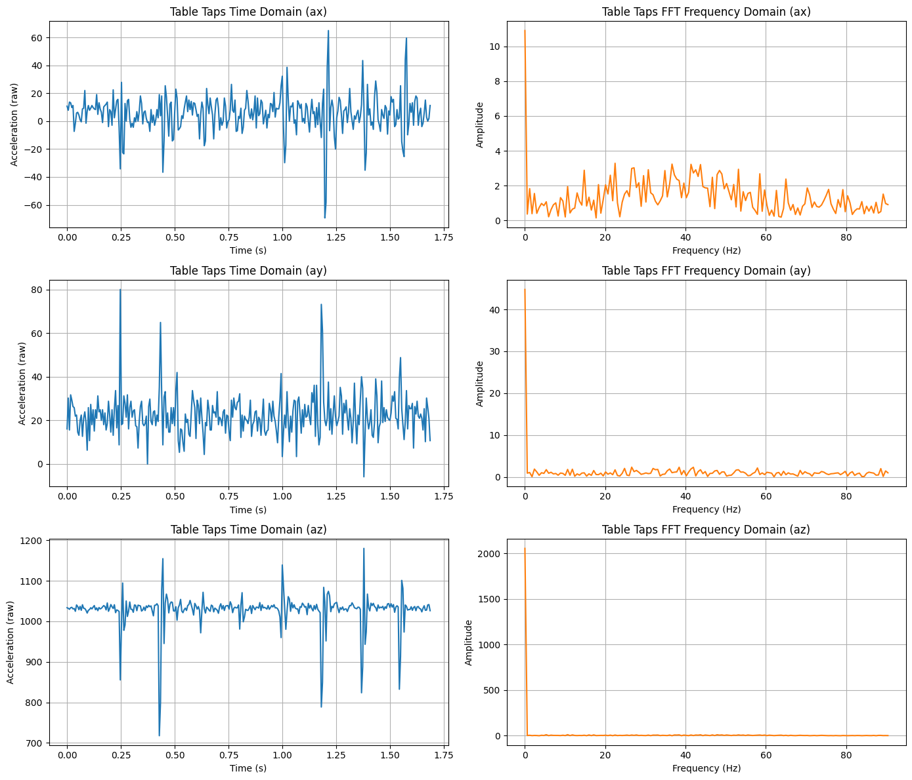
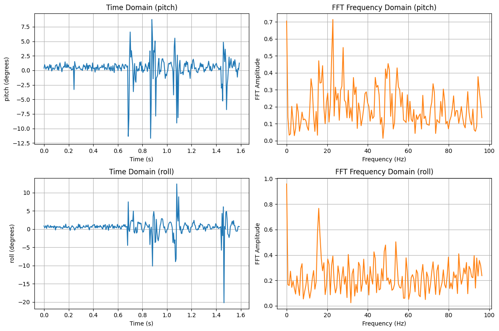


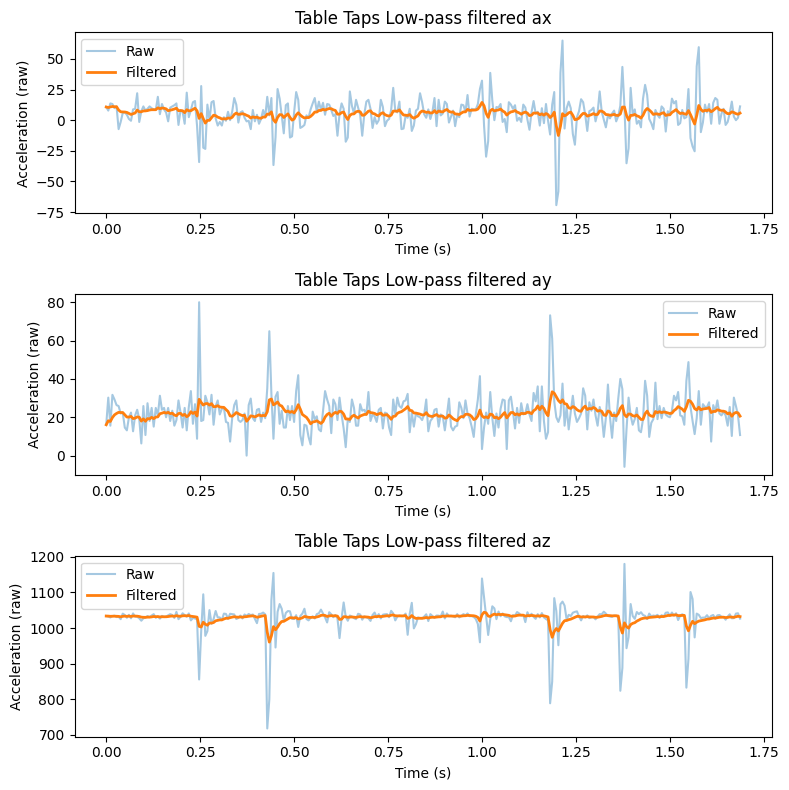
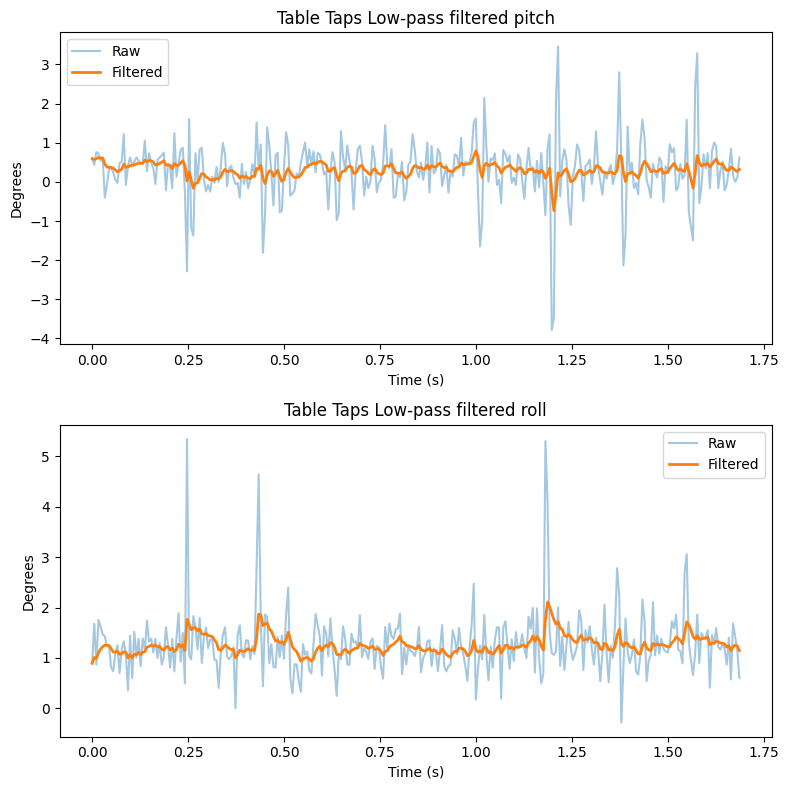


---
## Gyroscope

The gyroscope data showed the current angular velocity in a given direction (0 when stationary), so we must integrate over time to calculate the acceleration. The gyroscope is less noisy comparative to the accelerometer but drifts over time. On the other hand, the accelerometer is much more stable long term but is noisy and sensitive to vibration. 

It is easy to see how the gyroscope is less noisy compared to the accelerometer:
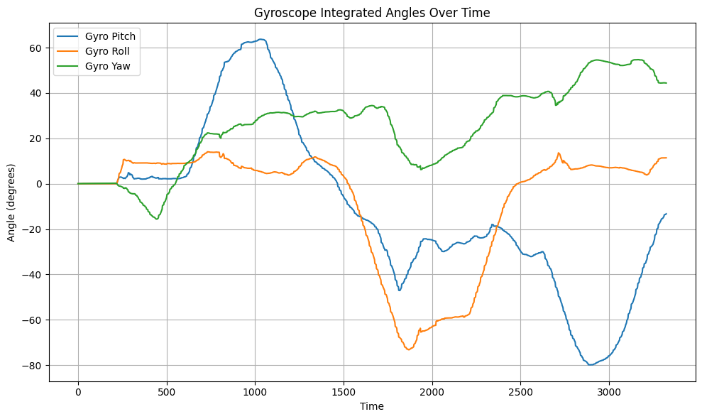


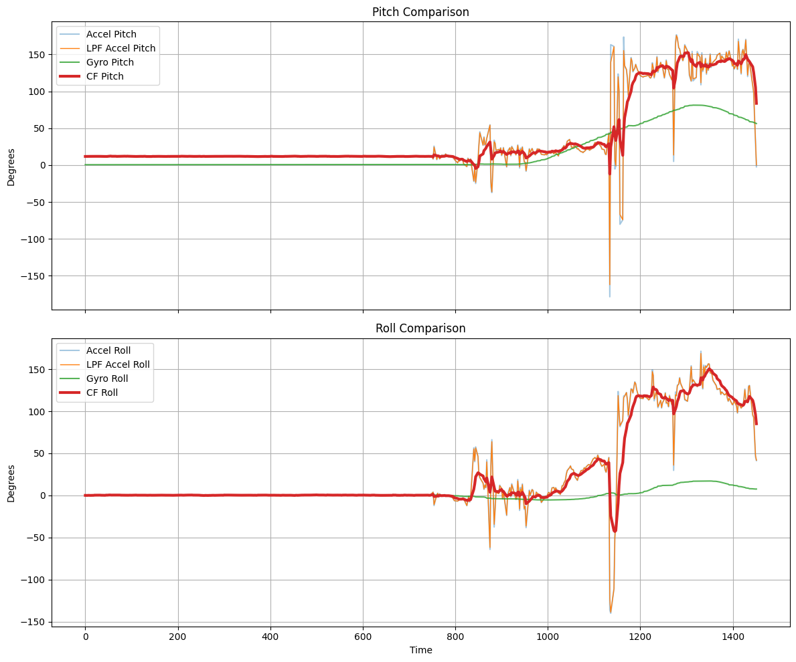


Furthermore, I found when the sampling frequency was low, the estimated angles were less accurate and showed noticeable lag. Fast movements were not captured well.

As the sampling frequency increased, the angle estimation became more accurate and responsive. Higher sampling rates improved tracking of quick changes in orientation but increased sensitivity to noise.

## Complementary Filter (Accelerometer + Gyroscope)

We can use a weighted average from both measurements from both the accelerometer and gyroscope to get the best of both worlds. This a higher coefficient $\alpha$ results in more weight for the accelerometer. 

$\theta = (1-\alpha ) (\theta_{prev} + \theta_g) + \alpha (\theta_{a})$

After filtering, the pitch and roll signals became much smoother and more stable. The filtered response produced angle estimates that were closer to the actual orientation. The gyroscope helped capture fast motion while the accelerometer corrected long-term drift.
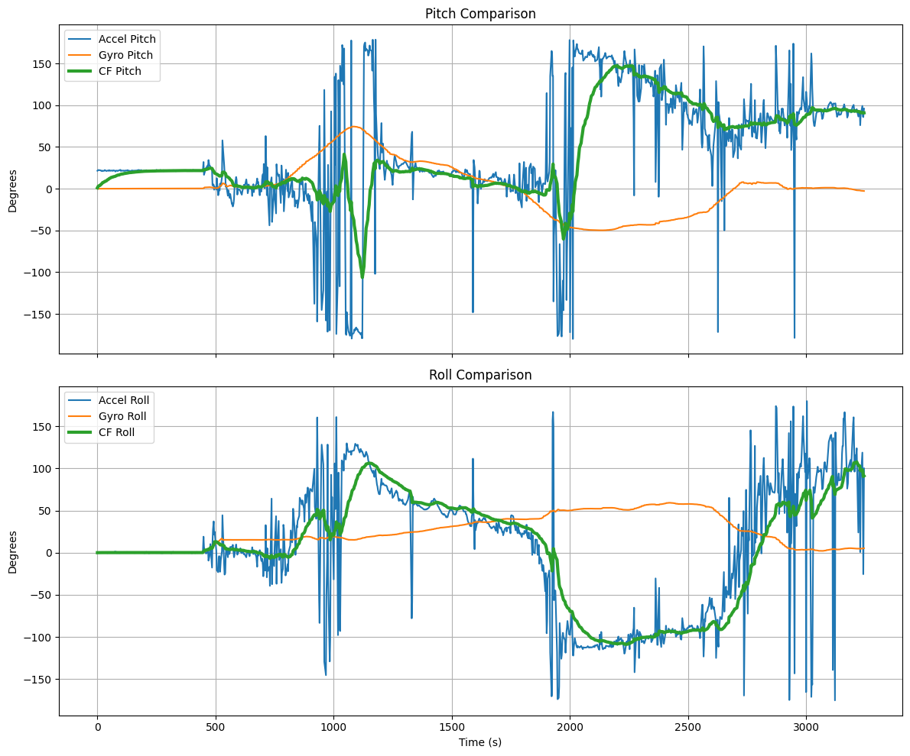


The code:
```c
void collectIMU()
{
    if (sample_count >= MAX_SAMPLES)
        return;
    
    unsigned long current_time = millis();

    myICM.getAGMT();

    time_arr[sample_count] = current_time;

    accX_arr[sample_count] = myICM.accX();
    accY_arr[sample_count] = myICM.accY();
    accZ_arr[sample_count] = myICM.accZ();

    float pitch_acc = atan2(myICM.accX(), myICM.accZ()) * 180.0 / M_PI;
    float roll_acc  = atan2(myICM.accY(), myICM.accZ()) * 180.0 / M_PI;

    pitch_arr[sample_count] = pitch_acc;
    roll_arr[sample_count] = roll_acc;

    // gyroscope
    gyrX_arr[sample_count] = myICM.gyrX();
    gyrY_arr[sample_count] = myICM.gyrY();
    gyrZ_arr[sample_count] = myICM.gyrZ();


    unsigned long now = micros();
    float dt = (now - last_time) / 1000000.0;  // seconds
    last_time = now;
    pitch_gyro += myICM.gyrX() * dt;
    roll_gyro += myICM.gyrY() * dt;
    yaw_gyro += myICM.gyrZ() * dt;

    pitch_gyro_arr[sample_count] = pitch_gyro;
    roll_gyro_arr[sample_count] = roll_gyro;
    yaw_gyro_arr[sample_count] = yaw_gyro;


    // complementary filter
    pitch_cf = (1 - ALPHA) * (pitch_cf + pitch_gyro)
            + (ALPHA) * pitch_acc;

    roll_cf = (1 - ALPHA) * (roll_cf + roll_gyro)
            + (ALPHA) * roll_acc;

    pitch_cf_arr[sample_count] = pitch_cf;
    roll_cf_arr[sample_count]  = roll_cf;

    sample_count++;
}
```


## Sample Data

In order to speed up the execution of the main loop I commented out my `Serial.print` and `delay()` statements and checked if the data is ready in every iteration of the main loop. 

```c
void loop() {
    // Listen for connections
    BLEDevice central = BLE.central();

    // If a central is connected to the peripheral
    if (central) {
        // While central is connected
        while (central.connected()) {

            write_data();

            if (myICM.dataReady() && recording) {
                collectIMU();
            }
            read_data();
        }
    }
}
```


I also collected and stored time-stemped IMU data using flags to start/stop data recording.
```c


case START_RECORDING:
    sample_count = 0;
    recording = true;
    last_time = micros();
    break;

case STOP_RECORDING:
    recording = false;
    break;

```

I decided to split up my arrays into their corresponding categories: accelerometer, accelerometer calculations, gyroscope, gyroscope calculations, and complementary filter. This is because it makes the design more modular. I decided to use floats because they offer sufficient precision while also being half the size of a double.

Apollo3 (Artemis) has 384 KB SRAM total. 

Global variables use: 101,288 bytes
Remaining dynamic memory: 291,928 bytes

I have 14 total arrays where each float is 4 bytes.  Each sample costs 14 × 4 = 56 bytes per time step. Therefore, the maximum number of time steps possible is 291,928 / 56 = 5213 samples. 

At ~350 Hz: time = 5213 / 350 Hz. This is approximately 14.9 seconds.


Furthermore, my board can capture at least 5s worth of IMU data and send it over Bluetooth to the computer as shown with the example data output below:
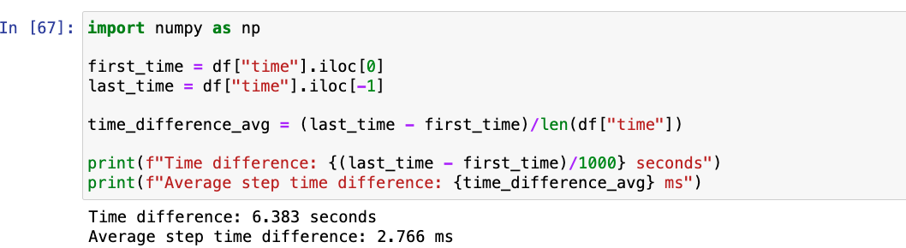


---
---
## RC Stunt

My [unnamed] car is somewhat fast. While initially testing the car, it was able to perform backflips and frontflips when sudden changes in direction. As the battery drains, it reduced its ability to perform stunts like flips.

It unfortunately suffers from lots of wheel slippage and inconsistent traction. This is especially noticable during high speeds moving straight or turning.

[](https://www.youtube.com/watch?v=umPyENcszeQ )


[](https://www.youtube.com/watch?v=gpTNgeiMUK4 )


