<article class="article">

## Prelab

### I2C Address

The ToF sensors have a default I2C address of 0x52. If two devices share the same address and are connected at the same time, they will both try to answer at once, causign an T2C bus collision. Choosing to programmatically change their address is more robust since both sensors can measure continously in parallel. To continously toggle XSHUT pins to select one sensor at a time means only one sensor can measure at a time, which for our purposes, is not ideal.

To avoid this problem, we can use the XSHUT pin to turn one of the ToF sensor off (set to LOW), such that it does not respond on the I2C bus, and then change the adress of the other ToF sensor. Once the sensor is back on (set to HIGH), both sensors can work in parallel but with different addresses. 

### Sensor Placement

One of the ToF sensors will placed at the front of the car to detect obstacles directing in its driving direction. 

The other will be on the side of the car (perpendicular to driving direction) to detect obstacles to the side. This will be useful in awareness for turning or navigating alongside walls.

However, this means the car will have a blind spot of the opposite side and the back of the car.

### Wiring

I chose to attach the long cords to the ToF sensors. 

## Soldering (oh no)

### Schematic
[QWIIC Schematic](../../../public/fast-robots/lab3/QWIIC.png)
The blue connection indicated on the diagram above represents SDA, and the labeled yellow connection represents SCL.

## Working with ToF sensor
Screenshot of Artemis scanning for I2C device (and discussion on I2C address)
`File->Examples->Apollo3->Wire>Example05_Wire_I2C`

After connecting the first ToF sensor only and running `File->Examples->Apollo3->Wire>Example05_Wire_I2C`, the output I received was 
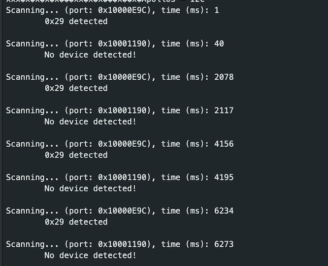

The address found for the connected ToF sensor is `0x29`. This is because the default I2C address for this ToF sensor of 0x52 (binary 0101 0010) is 8-bits of which the first seven are the device address while the rightmost (LSB) bit is the read/write flag. Notably, the scanner code (from `Example05_Wire_I2C`) reports 7-bit addresses:

```
for(uint8_t addr = 1; addr < 127; add ++ ){
  ...
}
```
where a 7-bit number can represent numbers 0 to 127 (2^7). 

Thus, to convert this 8-bit to a 7-bit address to disregard the R/W flag, the address is shifted to the right (0x52 >> 1), resulting in an address of 0x29 (binary 0010 1001). 

Refer to the snippet from the datasheet for an elaboration of the address:
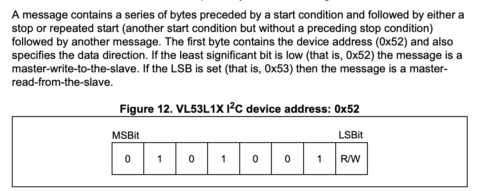

### Shorter is Better
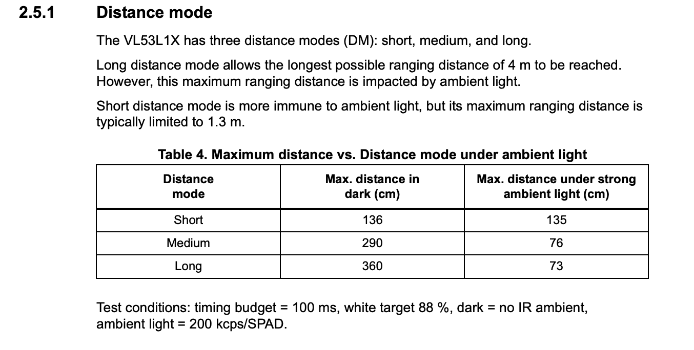
Given the ToF sensor has three modes (Short, Medium, and Long) that optimize the ranging performance given the maximum expected range:

| Mode                               | Max Range | Pros  | Cons       | Best Use Case                                 |
| ---------------------------------- | --------- | ---------------------------------- | ------------------------------ | ------------------------- |
| **Short**                          | ~1.3 m    | Immune to ambient light<br>More stable readings in bright environments<br>Fastest min timing budget (fastest measurements) | Limited maximum range  | Close-range obstacle detection, indoor robots |
| **Medium** *(Pololu library only)* | ~3 m      | Balanced between range and light immunity<br>More versatile than Short mode | Slightly affected by ambient light<br>Only available with Pololu VL53L1X library | General-purpose robotics         
| **Long** *(Default)*               | ~4 m      | Longest measurable distance<br>Good for open spaces      | Most affected by ambient light (down to 0.73m)             | Long-range detection in controlled lighting   |

The timing budget range for the Short mode is 20ms - 1000ms while the other modes are 33ms - 1000ms. 

Since Short mode is best in bright light (like in our lab classroom) and a fastest minimum timing budget of 20 ms (quicker updates so faster obstacle detection and navigation), I decided that it would be the best mode for our purposes. 


After referencing the code from `\Arduino\libraries\SparkFun_VL53L1X_4m_Laser_Distance_Sensor\examples\Example1_ReadDistance`, I tested various properties of the ToF sensor. 
'''c
case TOF_DATA:
    // TIME OF FLIHT
    float distance[10], time[10];
    for (int i = 0; i < 10; i++) {
        distanceSensor1.startRanging(); //Write configuration bytes to initiate measurement
        distanceSensor1.setDistanceModeShort();

        previousMillis = millis();
        while (!distanceSensor1.checkForDataReady())
        {
            delay(1);
        }
        distance[i] = distanceSensor1.getDistance(); //Get the result of the measurement from the sensor
        distanceSensor1.clearInterrupt();
        distanceSensor1.stopRanging();
        time[i] = millis() - previousMillis;

    }

    // send over bluetooth
    for (int i=0; i <10; i++) {
        tx_estring_value.clear();
        tx_estring_value.append("T:");
        tx_estring_value.append(time[i]);
        tx_estring_value.append(",D:");
        tx_estring_value.append(distance[i]);
        tx_characteristic_string.writeValue(tx_estring_value.c_str());

        Serial.print("t(ms): ");
        Serial.print(time[i]);
        // distance in mm
        Serial.print(", dist (mm): ");
        Serial.print(distance[i]);
        Serial.println();
    }
    break;
'''

#### Range Test
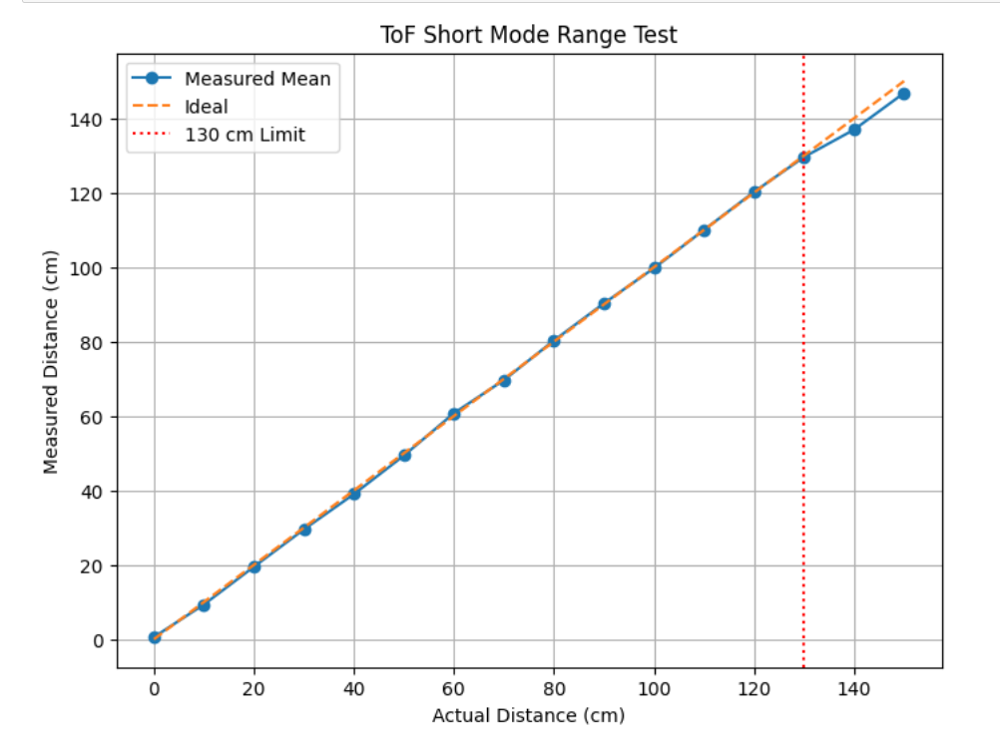. 
To verify the manufacturer’s short-mode range of approximately 130 cm, the sensor was tested at distances from 0 cm to 150 cm in 10 cm increments. At each position, ten distance readings were collected via BLE from the Arduino and averaged to reduce random noise. The mean measured distances were then plotted against the corresponding actual distances.

#### Accuracy
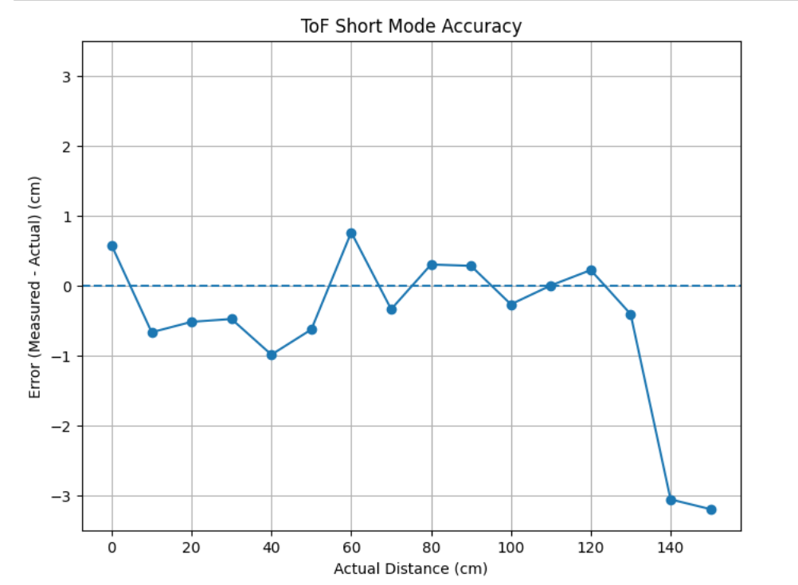.
To evaluate measurement accuracy, the error was calculated as the difference between the mean measured distance and the actual distance at each 10 cm interval. These error values were plotted against the actual distances to show how accuracy varies across the sensor’s operating range. We can observe an
decrease in accuracy as the range exceeds the ~1.3 max range. 

#### Repeatability
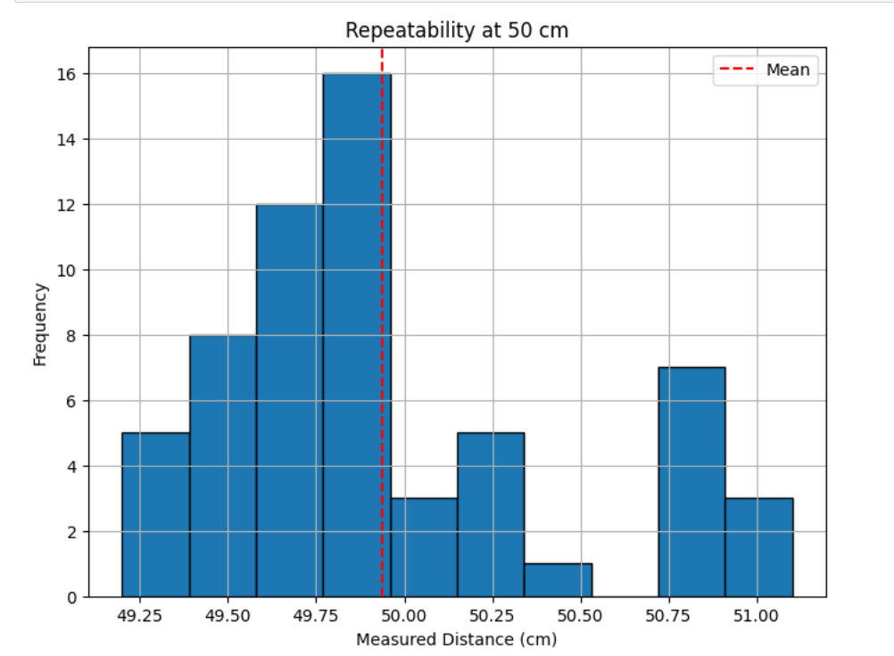

To evaluate repeatability, the sensor was fixed at a constant distance of 50 cm and multiple consecutive measurements were recorded without moving the target (5 times, 50 total measurements). The spread of these readings was visualized using a histogram, where the mean is approximately at 50 cm.

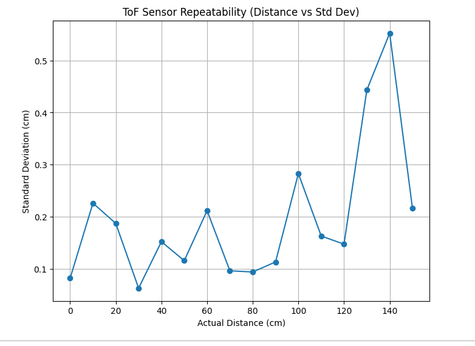
Then, I analyzed using the standard deviations of the distances from the 0-150 cm intervals. Once again, we can observe a small peak in standard deviation as the obstacle exceeds the 1.3m range, indicating that the sensor becomes less reliable as it goes beyond this maximum, which makes sense.

#### Ranging Time
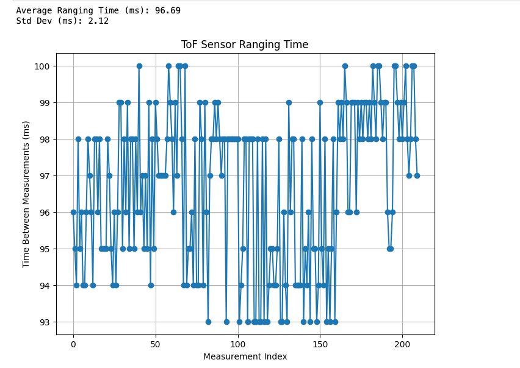
To determine the ranging time, the difference between timestamps were recorded for each measurement transmitted from the Arduino. The average is around 97 ms which may need to be optimized later on. These values were plotted to observe consistency in sampling rate to determine how quickly the system can detect obstacles and update control decisions in real time.


### Add Another ToF! (and the IMU)
To add the second ToF sensor, the first ToF sensor now has to be written to a new address, 0x30, while the address of the newly initialized ToF sensor is 0x52.

```c
pinMode(XSHUT1, OUTPUT);
digitalWrite(XSHUT1, LOW);   // sensor 1 OFF

if (distanceSensor1.begin() != 0) {
    Serial.println("Sensor 1 failed to begin. Check wiring.");
    while(1);
}
Serial.println("Sensor 1 online!");

distanceSensor1.setI2CAddress(ADDRESS);
digitalWrite(XSHUT1, HIGH);

if (distanceSensor2.begin() != 0) {
    Serial.println("Sensor 2 failed to begin. Check wiring.");
    while(1);
}
Serial.println("Both online!");
```

After connecting the second ToF sensor, I confirmed that both work
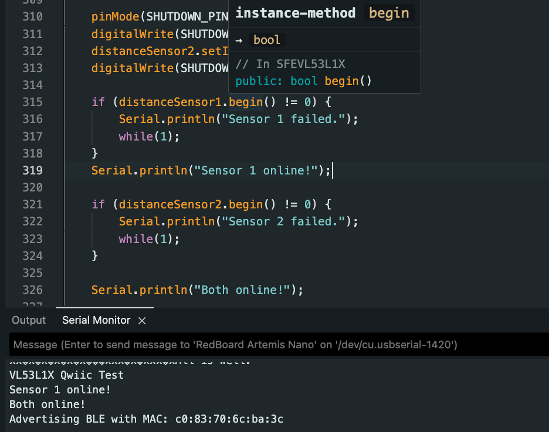

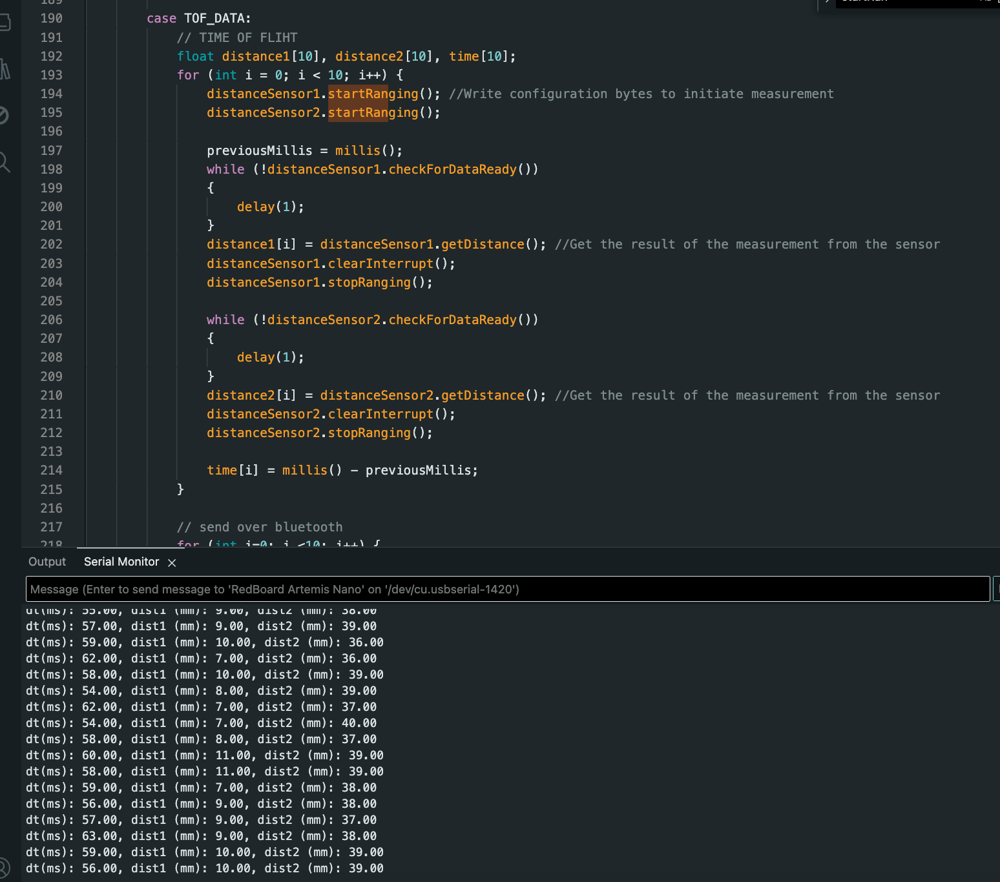


### FASTERR
Calling distanceSensor.checkForDataReady() routine was to check when new data is available to then print new ToF sensor data from both sensors only when available.

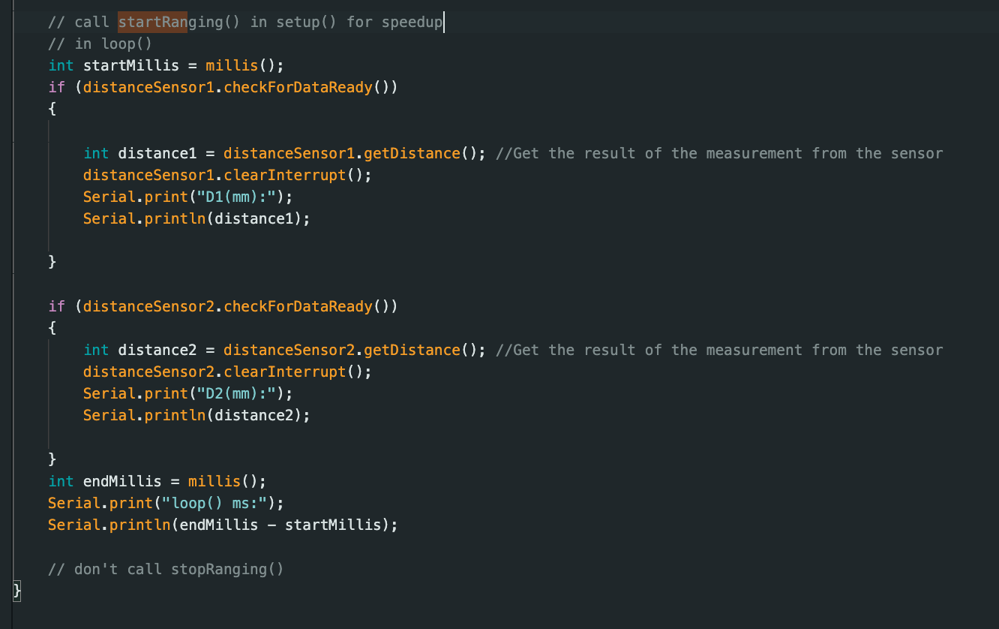

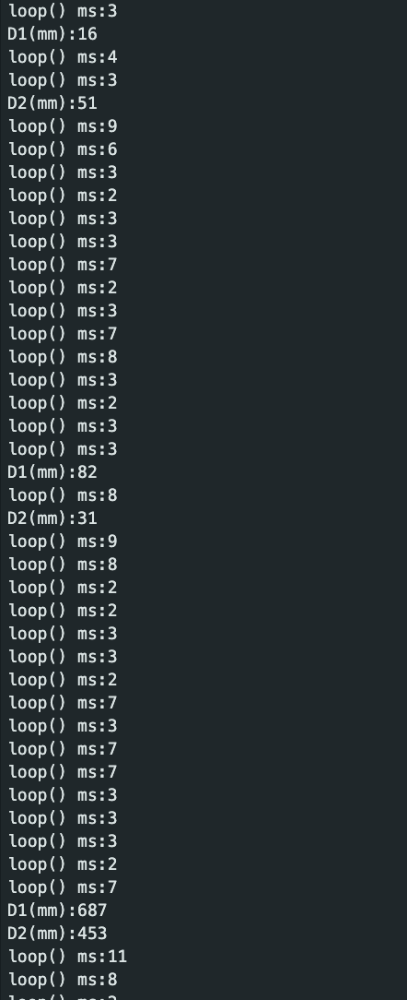
We can observe in the above that when time is continuously output in the serial monitor, it is fastest within a few milliseconds each time. However, when data was collected and available, the loop took much longer. Thus, the limiting factor is data acquisition for the ToF sensor data. 

The limiting factor is the time needed to record distance measurements.

### Edit Lab 1
I edited my previous lab work to send the data over bluetooth.

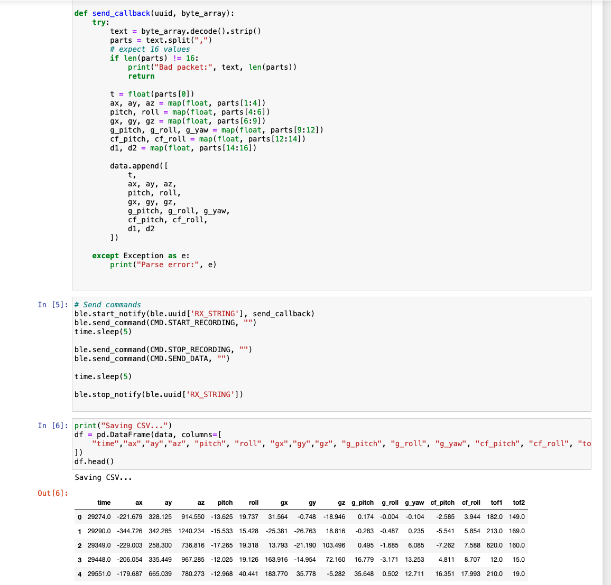

To demonstrate the two ToF sensor data could be sent over bluetooth, I plotted the time and measured distance for each sensor on the same plot where moving an obstacle closer to one moved it away from the other. 
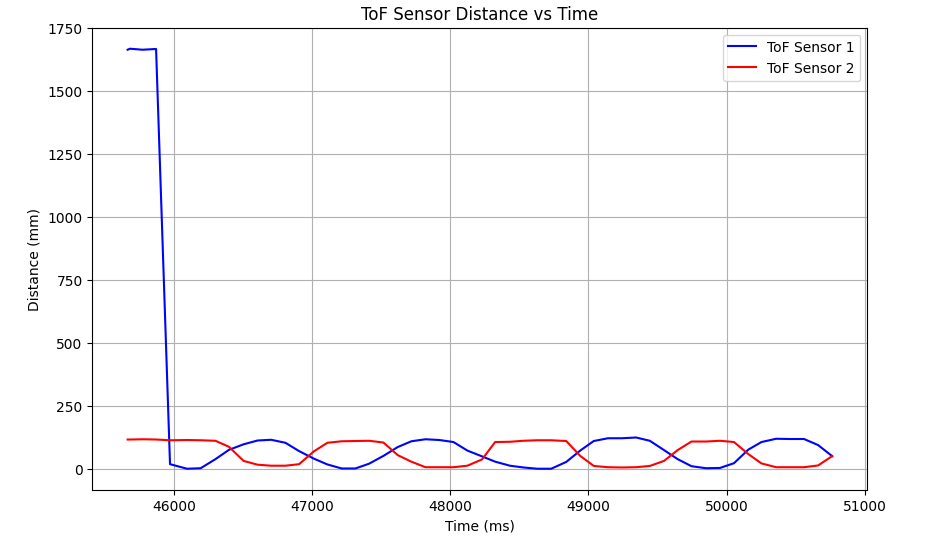


I also plotted the IMU data indicating the pitch and roll angle versus time. 
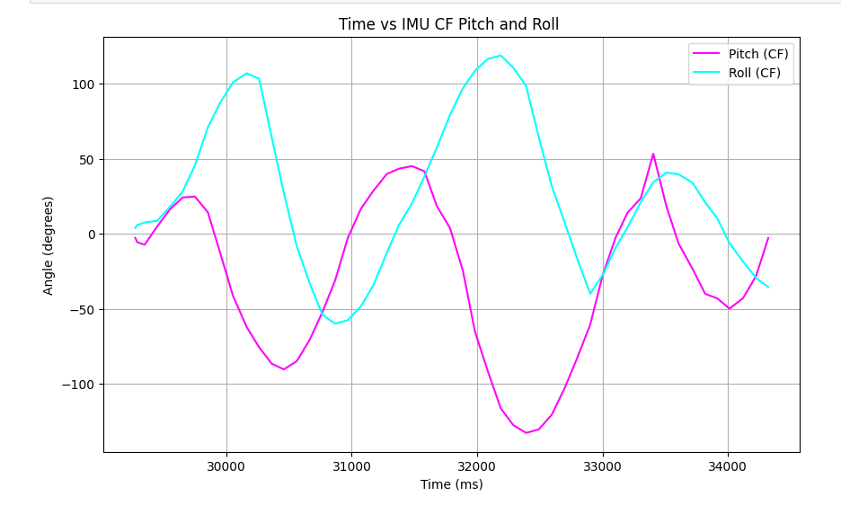


## 5000-level Questions
Many distance sensors are based on infrared trasmission. 

Infrared reflective sensors estimate distance by emitting infrared light and measuring the intensity of the reflection from nearby objects. They are simple, low-cost, and work well at short ranges. However, their readings are strongly affected by surface color, texture, and ambient light, which can reduce accuracy and reliability under different conditions.

On the other hand, ToF sensors, measure distance by emitting a modulated IR laser pulse and calculating the time it takes to return. It provides highly accurate, linear measurements over longer distances and is less affected by object color or ambient light. The main drawbacks are higher cost.

To test the ToF sensitivity of sensors to colors and textures, I used 2 different colors and 3 textures (brown paper, light blue fluffy cloth, reflectiive/mirror) for obstacles at a distance of 30 cm away. 

I found that color and texture and even reflective surfaces did not have any affect on the sensitivity of the sensor. Outputs can be found below.

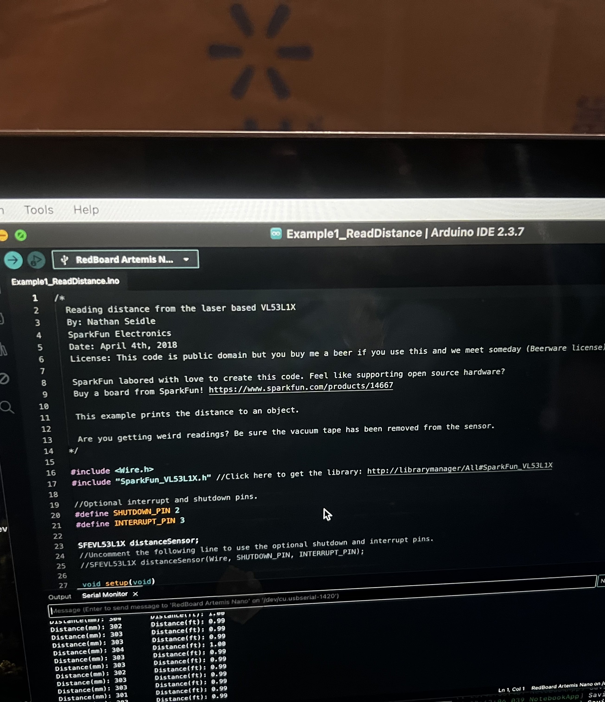


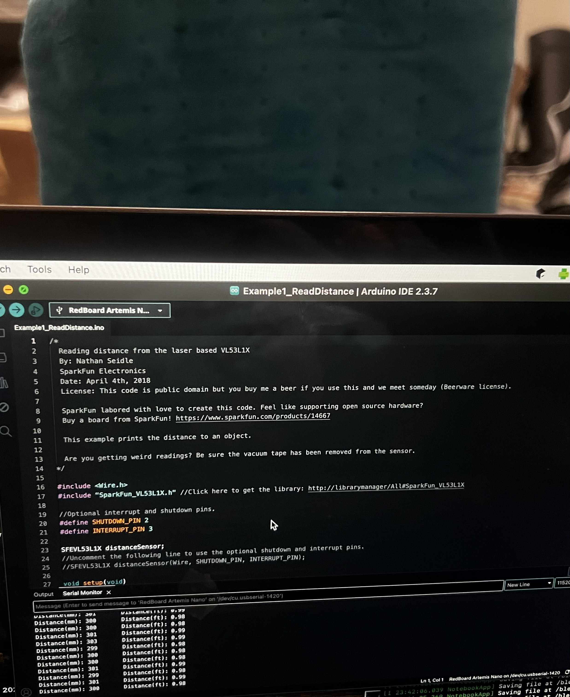


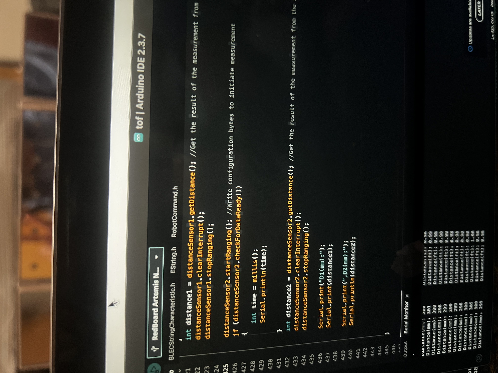


## Acknowledgements
I referenced Katarina Duric from 2025!
