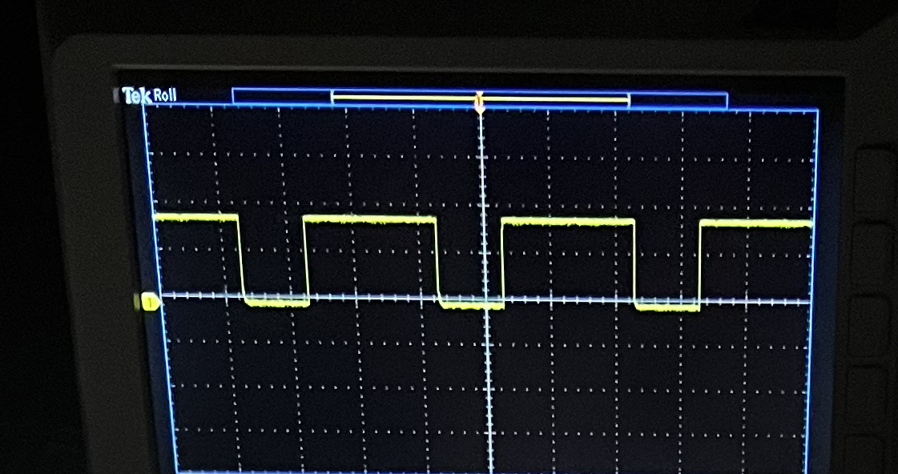
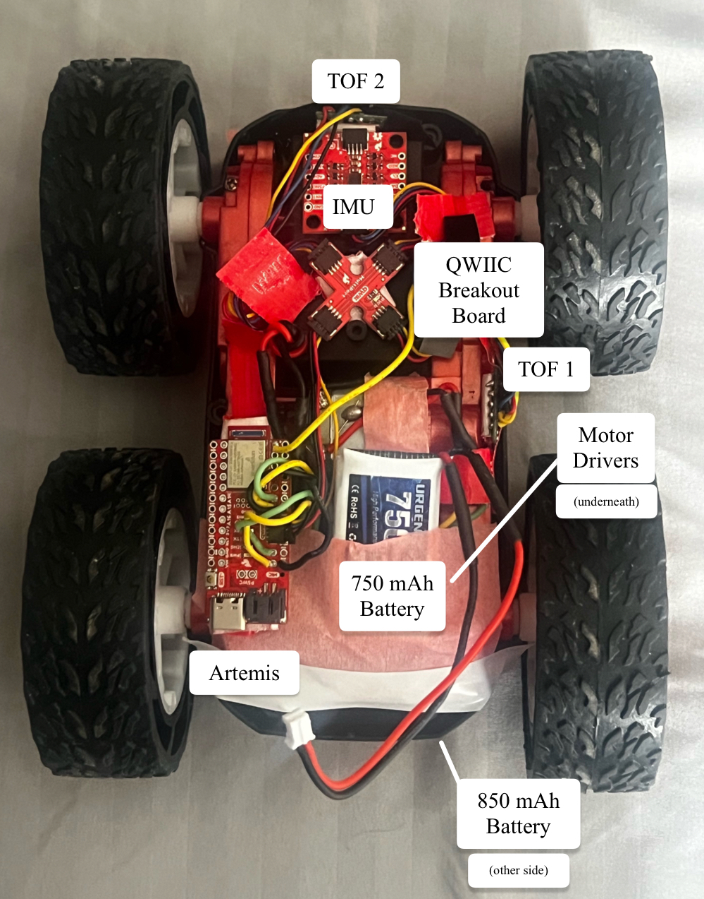
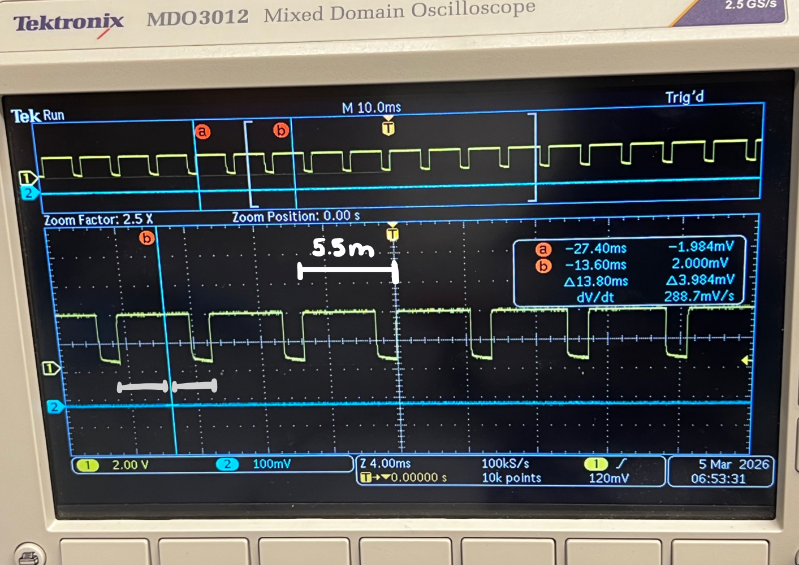
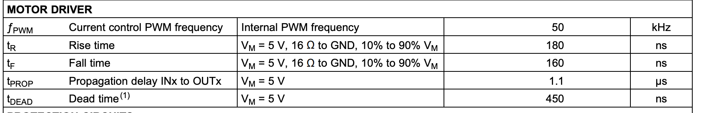

<article class="article">

## Prelab

### Dual Motors & Pin Choice
Diagram with your intended connections between the motor drivers, Artemis, and battery (with specific pin numbers)

Since not every pin the Artemis can give PWM signal, I had to be careful to choose which pins I used for control.
In the [Redboard Artemis Nano pin documentation](https://cdn.sparkfun.com/assets/5/5/1/6/3/RedBoard-Artemis-Nano.pdf), any pin marked with a tilde symbol ~ is a PWN pin. Therefore, taking this and the physical placements of my board, I decided to use A0-A3.


### Battery 

Our DC motors have a lot of electrical noise (EMI) due to the fast switching & high current PWM signals which can disrupt our sensitive electronics such as the Artemis. To prevent this noise from affecting our microcontroller, we must power the Artemis and the motor drivers/motors from separate batteries.

The Artemis will be powered by the 750mAh battery and the motor drivers & motors are powered by the second 850mAh battery. 

## Motor Drivers & Oscilloscope Testing

To test, the motor driver are powered from an external power supply in place of using the 850mAh battery.

In the [DRV8833 motor driver documentation](https://www.ti.com/lit/ds/symlink/drv8833.pdf?HQS=dis-dk-null-digikeymode-dsf-pf-null-wwe&ts=1740659196269), the power supply voltage range is from 2.7 to 10.8 V. Since the voltage of the 850mAh battery is 3.7V, the output of the power supply was set to 3.7V to represent the battery that will eventually power the motors.

```c
#define MOTOR1_PIN1 0  // PWM-capable pin
#define MOTOR1_PIN2 1  // PWM-capable pin

void setup() {
  pinMode(MOTOR1_PIN1, OUTPUT);
  pinMode(MOTOR1_PIN2, OUTPUT);
}

void loop() {
  digitalWrite(MOTOR1_PIN2, LOW);  

  analogWrite(MOTOR1_PIN1, 255);  // full ON
  delay(200);

  analogWrite(MOTOR1_PIN1, 0);    // full OFF
  delay(100); 

  analogWrite(MOTOR1_PIN1, 100);  // ~39% duty cycle
  delay(200);

  analogWrite(MOTOR1_PIN1, 0);    // full OFF
  delay(100);

}
```

One pin was set to switch between HIGH, less than HIGH, and LOW, while the other pin had an output of 0. This was repeated for both motor drivers, so four pins in total. If the PWM value is less than 255, the signal repeatedly switches between HIGH and LOW. For example, an `analogWrite(pin, 100)` results in a ~39% duty cycle where it is HIGH for 39% of the period LOW for 61% of the period.


To test the Pulse Width Modulation (PWM) signal, I used an oscilloscope and power supply to observe the outputs of the motor driver. Below is a close up of the oscilloscope and the correspond video of the setup.


[](https://www.youtube.com/watch?v=-NDx379X860)


This shows that power can be regulated on the motor driver output. 

### A New Spin on the Situation
I then connected the two drivers to the provided wheels. First, I connected a single motor driver to one side of the wheels and tested the behavior with the above code to show that I can run the motor in both directions. 

```c
#define MOTOR1_PIN1 0
#define MOTOR1_PIN2 1 

void setup() {
  pinMode(MOTOR1_PIN1, OUTPUT);
  pinMode(MOTOR1_PIN2, OUTPUT);
}

void loop() {

  analogWrite(MOTOR1_PIN1, 200);
  delay(500);

  analogWrite(MOTOR1_PIN1, 0);
  delay(2000); 

  analogWrite(MOTOR1_PIN2, 200); 
  delay(500);

  analogWrite(MOTOR1_PIN2, 0);
  delay(2000);

}
```

[](https://www.youtube.com/watch?v=H4CORc9SBE8)

---

### Bumpy Road
After connecting the motor drivers to the car, I encountered several issues. The second motor driver did not cause the motor to move. I confirmed that this was not a motor issue, since the same motor functioned properly when connected to the first motor driver.

During the lab section, I debugged the system by measuring the PWM signal with an oscilloscope. I observed that the PWM signal was present at the input of the motor driver, but there was no corresponding PWM signal at the output. Julie aided in checking over the connections and hypothesized that my soldering may have caused a short at some point on the board.

I then obtained new motor drivers and resoldered the connections, taking extra care to ensure the soldering was clean.


Below are pictures of the re-tested PWM signals:



I then attached the motor drivers to the motors once again. I confirmed that both wheels can spin in both directions, with the battery driving the motor drivers. 


```c
#define MOTOR1_PIN1 0  // A1 IN, B1 IN: right
#define MOTOR1_PIN2 1  // A2 IN, B2 IN: right
#define MOTOR2_PIN1 2  // A1 IN, B1 IN: left
#define MOTOR2_PIN2 3  // A2 IN, B2 IN: left

void setup() {
  pinMode(MOTOR1_PIN1, OUTPUT);
  pinMode(MOTOR1_PIN2, OUTPUT);
  pinMode(MOTOR2_PIN1, OUTPUT);
  pinMode(MOTOR2_PIN2, OUTPUT);
}

void forward() {
  analogWrite(MOTOR1_PIN1,150); 
  analogWrite(MOTOR1_PIN2,0);
  analogWrite(MOTOR2_PIN1,150); 
  analogWrite(MOTOR2_PIN2,0);
}
void backward() {
  analogWrite(MOTOR1_PIN1,0); 
  analogWrite(MOTOR1_PIN2,150);

  analogWrite(MOTOR2_PIN1,0); 
  analogWrite(MOTOR2_PIN2,150);
}

void loop() {
  forward();
  delay(2000);
  backward();
  delay(2000);

}
```

### Installation
My full car with all hardware components attached can be seen below.



### [P]retty [W]eak [M]ovement

To find the minimum PWM value for which the car needs to move forward from rest, I started at 0, increasing it by 10 until the car moved. This mostly depended on the battery life of the motors. I found that early in my experimenting, the minimum PWM to start inching was at 100-110 . Later on, the movement started at 150, as seen in the video. 

```c
case FIND_MIN_PWM:
  for (int speedValue = 0; speedValue < 255; speedValue += 10) {
    tx_estring_value.clear();
    tx_estring_value.append("PWM:");
    tx_estring_value.append(speedValue);
    tx_characteristic_string.writeValue(tx_estring_value.c_str());

    forward(speedValue);

    delay(2000);
}
```

Then, I started the established PWM value (150) minus 10, starting at 140 and then incrementing by 1 to determine a more precise value. I found that the car would begin to crawl at PWM 143 and then drive fully at 144 (second try in my video).
```c
for (int speedValue = 140; speedValue < 255; speedValue += 1) {
    tx_estring_value.clear();
    tx_estring_value.append("PWM:");
    tx_estring_value.append(speedValue);
    tx_characteristic_string.writeValue(tx_estring_value.c_str());

    forward(speedValue);
    // turnLeft(speedValue);
    // turnRight(speedValue);

    delay(2000);
}

```
[](https://www.youtube.com/watch?v=bLHLG4CThG0)


I performed a similar experiment for the on axis turns to both turn left and right. 

Turning left on axis required a minimum PWM of 154 (starting inching around 150). 
[](https://www.youtube.com/watch?v=uWP-CvAturQ)

Turning right on axis required a minimum PWM of 162 (starting inching around 150). 

[](https://www.youtube.com/watch?v=NN_hucDamHw)


### Straight to the Point
While testing the car’s minimum PWM, I observed that the right side typically began moving later than the left. As a result, the RC car would only start traveling straight at a higher PWM than expected and would initially veer slightly to the right. To determine the PWM value at which the right side would catch up with the left, I conducted a similar test to the previous section, this time holding the RC car by hand. Although the results varied somewhat, the right side most often began moving at a rate comparable to the left at around PWM 140. 

[](https://www.youtube.com/watch?v=i3RuSq_zf28)


I compensated for the motor deadband. After further adjustments to the calibration, I found that setting the right deadband to 130 and adding a slight downscale (0.80) allowed both sides to move at similar speeds.


```C
int calibrateRight(int pwm){
    const int RIGHT_DEADBAND = 130;
    const float RIGHT_SCALE = 0.80; 
    if(pwm == 0) return 0;

    int corrected = map(pwm, 0, 255, RIGHT_DEADBAND, 255);
    return corrected * RIGHT_SCALE;
}
```

[](https://www.youtube.com/watch?v=0McPTuAvXUk)


## 5000-Level Questions



In the image above, the top shows the markers for (a) and (b). The total time elapsed was 13.8ms, and I approximated there were two and a half cycles within the interval to estimate the period (13.8 / 2.5 = 5.5 ms).

For the PWM signal, the rising-edge to rising-edge measurement for the period is approximately 5.5 milliseconds. Thus, frequency analogWrite generates at a frequency of 1/0.0055s = 181 Hz.  




From the motor driver documentation, the maximum internal PWM frequency is 50 kHz, which is much higher than my PWM frequency. This means that my DC motors are *not* performing optimally, which I can observe since the motors can produce audible buzzing and lags. But, this frequency is sufficient to drive the DC motors as they will still respond to the average voltage produced by the PWM signal.

A faster PWM signal would reduce audible noise since low-frequency PWM produces noticeable buzzing in motors. Higher frequencies also produce smoother motor torque by reducing current ripple through the motor inductance. Additionally, faster PWM can improve efficiency and provide finer control over motor speed, making movement much smoother. 

Because the PWM on the Artemis is generated by the hardeare timer, I could try to change the built in timer. 

### Lowest PWM value speed (once in motion) 
To figure out the lowest PWM value to keep the RC car running once it is in motion, I implemented the following program, seeing the minimum PWM value before the RC car stopped moving. 

```c
case FIND_MIN_PWM:
    tx_estring_value.clear();
    tx_estring_value.append("PWM:");
    tx_estring_value.append(150);
    tx_characteristic_string.writeValue(tx_estring_value.c_str());
    forward(150); // overcome static friction
    delay(1000);
    for (int speedValue = 40; speedValue >= 15; speedValue -= 1) {
        tx_estring_value.clear();
        tx_estring_value.append("PWM:");
        tx_estring_value.append(speedValue);
        tx_characteristic_string.writeValue(tx_estring_value.c_str());

        forward(speedValue);
        delay(2000);  
    }

    stopMotors();

    break;

```
I found that the minimum PWM to keep the RC car moving in a straight line when it was already in motion was approximately 23. 

[](https://www.youtube.com/watch?v=OEGjTs4Y_XA)


`Note: I reached the daily limit for Youtube uploads, so videos from this point on are temporarily uploaded to Google Drive but will update this page with proper Youtube links after limit resets.`
For a left on axis turn, the minimum PWM to keep the RC car moving when it was already in motion was approximately 75. 


For a right on axis turn, the minimum PWM to keep the RC car moving when it was already in motion was approximately 53. 


## Acknowledgements 
 I referenced the past lab reports from Katarina Duric and Aidan McNay from from Spring 2025. I give my thanks to Dyllan Hofflich for letting me borrow his soldering kit! Thank you to TA Julie for assisting me in debugging and getting new motor drivers. 