<article class="article">

## Prelab

### Sending and Receiving Data over Bluetooth

A hard deadline on the Artemis stops the motors even if BLE drops. Data (time, ToF distance, PID terms, motor PWM) is stored in pre-allocated arrays. 

Each sample is written to the BLE TX characteristic. A 15 ms delay between packets prevents buffer overflows


Consider adding code snippets as necessary to showcase how you implemented this on Arduino and Python

I added commands
```c
START_PID,    // start PID run (5 s window)
SEND_PID_DATA, // stream back arrays
SET_GAINS     // update Kp/Ki/Kd without reflashing
```


In particular, 
```c
case SET_GAINS: {
    float kp_new, ki_new, kd_new;
    robot_cmd.get_next_value(kp_new);
    robot_cmd.get_next_value(ki_new);
    robot_cmd.get_next_value(kd_new);
    Kp = kp_new; Ki = ki_new; Kd = kd_new;
    break;
}
```

### Hard Stop
The Artemis checks `millis() - pid_start_time > 5000` every loop iteration and calls stopMotors() unconditionally. This fires even if the Bluetooth connection fails.


## Proportional-Integral-Derivative (PID) Controller Design

The goal is to drive the robot toward a wall as fast as possible and stop precisely at 1 foot away. When the robot is far away, e is large and positive, then motors drive forward. As it approaches, e shrinks, then motors slow. 

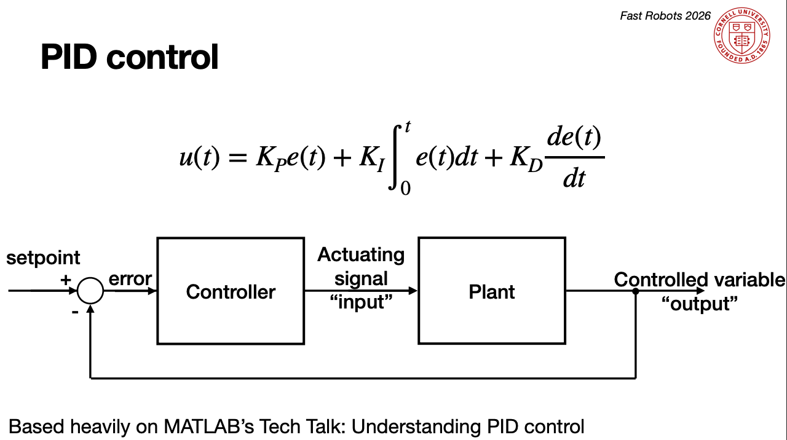

e(t) is the error between the current position measured by the ToF sensor and the desired target position.

```c
// in loop()
if (pid_running) {
    run_pid_step();
    if (millis() - pid_start_time > 5000) { // stop after 5 s
        stopMotors();
        pid_running = false;
    }
}
```

```c
int scaleToPWM(float pid_output) {
    if (abs(pid_output) < 10) return 0;
    int sign = (pid_output > 0) ? 1 : -1;
    int pwm  = DEADBAND + (int)abs(pid_output);
    if (sign < 0) pwm = (int)(pwm)
    return sign * constrain(pwm, 0, MAX_PWM);       
}
```


### Kp (The bigger the mistake, the bigger the correction now)
I started with the proportional term, where correction = proportional gain x error e(t). I varied different values of Kp and kept Ki and Kd equal to 0. 

```c
// in run_pid_step()

// ===================== PROPROTIONAL ==================
float error   = curr_dist - SETPOINT; //if negative, go forward
float kp_term = Kp * error;

// code here...


    float total = kp_term + ki_term + kd_term;
    int   pwm = scaleToPWM(total);

    if (pwm > 0) {
        forward(pwm);
    }
    else if (pwm < 0) {
        backward(-pwm);
    }
    else{ 
        stopMotors();
    }

    log_pid(now, data_ready, curr_dist, (int)kp_term, (int)ki_term, (int)kd_term, (int)total, pwm);
    
```

I started off with Kp = 0.03, which was a bit too conservative but Kp = 0.08 was overshot.

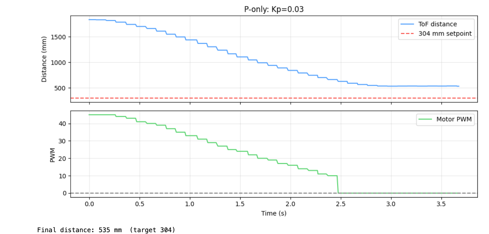
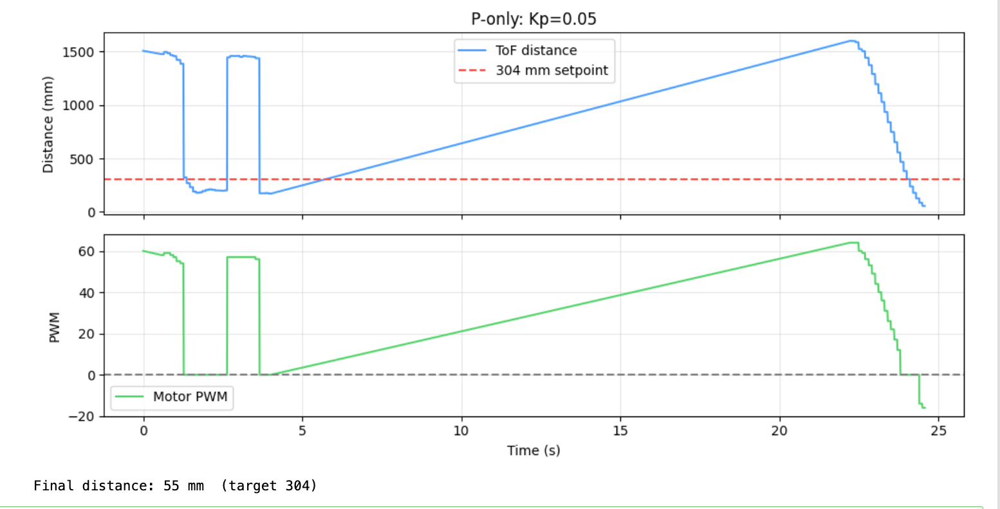

After adjusting the Kp, I found that the optimal value of Kp is 0.05 at a distance of 2m away. I was able to replicate it multiple times (run in the video is a different time than the produced chart below, but similar results).

[](https://www.youtube.com/watch?v=HrFK-ZrbcGg)


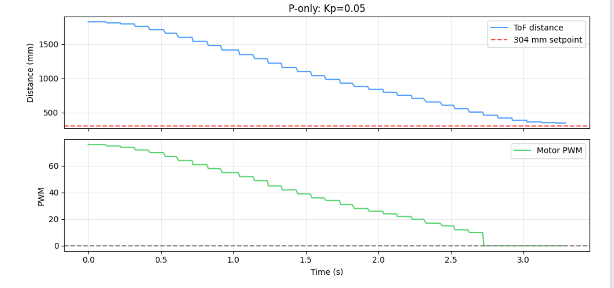


### Ki (Fix mistakes that last a long time)
Pure P-control can leave a small steady-state offset because the motor deadband means a tiny error produces no output at all. Wind-up protection is applied (see 5000-level section below).

For PI Controller, we keep Kd = 0 for now. 

```c
integral += error * dt;
float ki_term = Ki * integral;
```

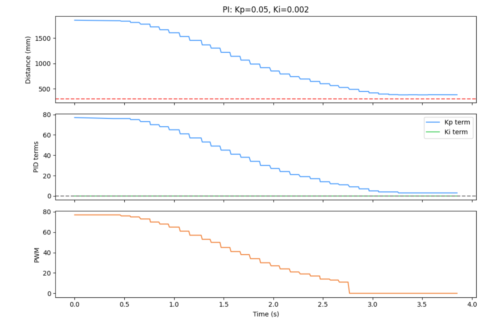

A small integrator (Ki = 0.002) accumulates error over time and nudges the robot the last few millimeters to the setpoint. 

[](https://www.youtube.com/watch?v=5hTwfsKP_yo)


### Kd (Slow down before overshooting: watch the future)
The robot accelerates quickly and, without derivative action, tends to overshoot and crash into the wall. The derivative term brakes proportionally to how fast the error is changing (how fast the robot is approaching). 

```c
if (!first_pid && dt > 0) {
    float d_raw  = (error - error_prev) / dt;
    kd_term = Kd * d_raw;

```

The raw derivative amplifies sensor noise (tiny jitters). 

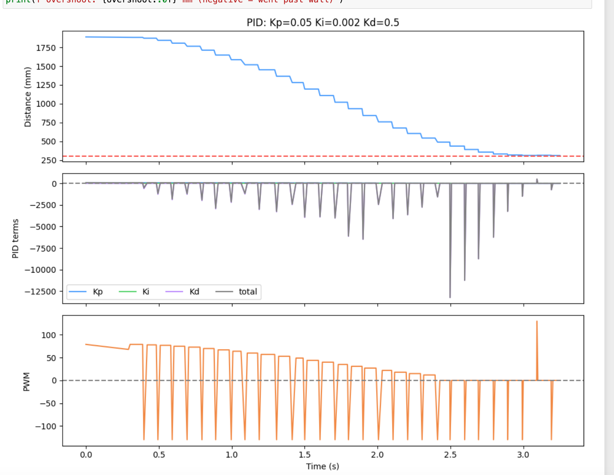


[](https://www.youtube.com/watch?v=5hTwfsKP_yo)


Due to the sensor noise, a low-pass filter (exponential moving average) on the derivative prevents amplifying sensor noise. D_ALPHA is a smoothing factor where a high D_ALPHA means the derivative follows raw error closely (less smoothing, more sensitive). A low D_ALPHA makes the derivative smoother (less sensitive to noise). Thus, the filtered derivative is smoother, has less noise amplification, but a slightly slower response.

```c
if (!first_pid && dt > 0) {
    float d_raw  = (error - error_prev) / dt;

    d_filtered   = D_ALPHA * d_raw + (1.0f - D_ALPHA) * d_filtered;
    kd_term      = Kd * d_filtered;
}

```

The LPF with D_ALPHA=0.3 blends in new values slowly, smoothing the signal. If the approach is sluggish and very jittery, raise D_ALPHA. If it is still noisy, lower it. I found D_ALPHA to be the most suitable.

[](https://www.youtube.com/watch?v=5hTwfsKP_yo)


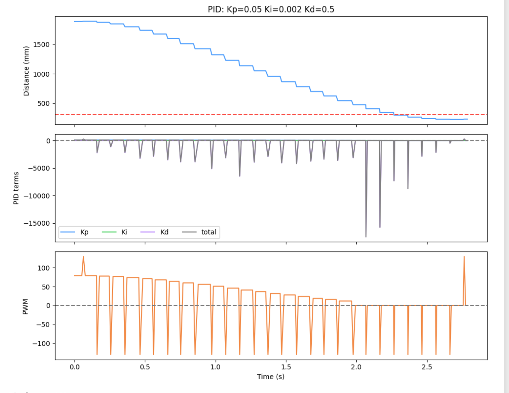


## ToF Sensor: Range & Sampling Time
First, I discovered the limiting factor. My PID controller loop rate wass limited by the sensor (~10 Hz), on how often new data was readily available.
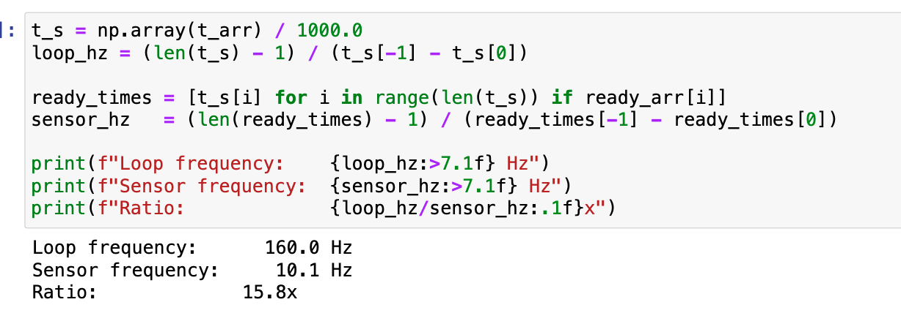


### Extrapolation
To fix this, I ran the PID every loop iteration while estimating the distance between real sensor reads using a linear extrapolation from the last two measurements when data was not available. The extrapolator uses the last two sensor readings to linearly predict the current distance while waiting for the next real measurement.


`Note: I reached the daily limit for Youtube uploads, so videos from this point on are temporarily uploaded to Google Drive but will update this page with proper Youtube links after limit resets.`
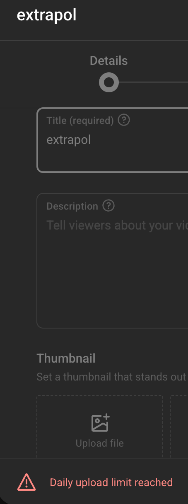


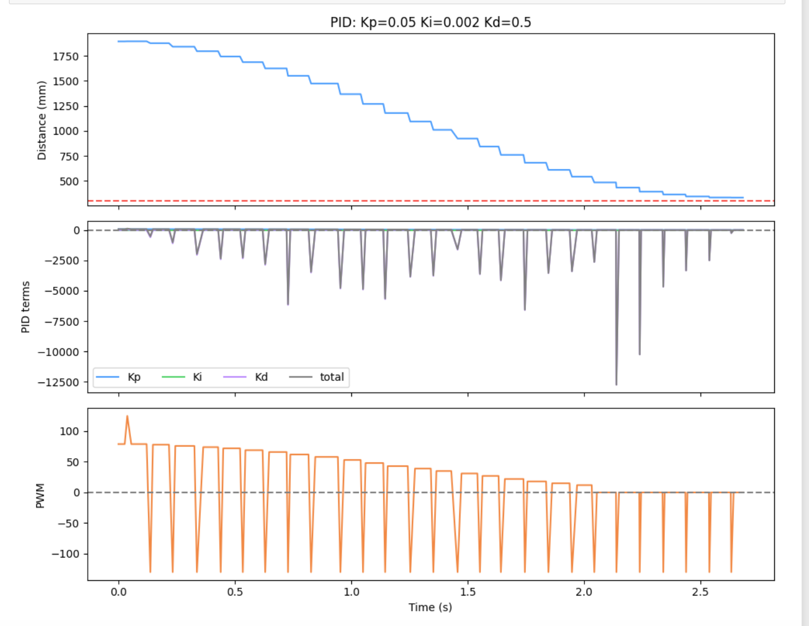

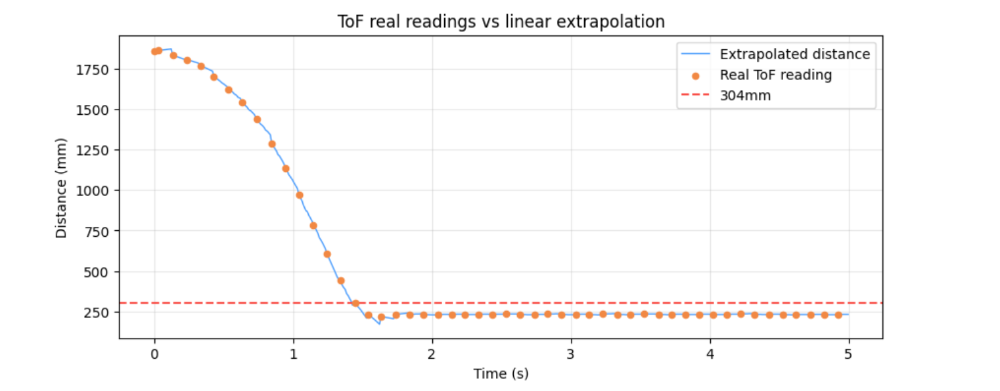


[PID Controller, Extrapolation](https://drive.google.com/file/d/1PD8AgmccppMnegKdF_xzVx3STeNmeP0h/view?usp=sharing)


```c
// in run_pid_step()
if (distanceSensor2.checkForDataReady()) {
    last_last_distance = last_distance;
    last_last_distance_time = last_distance_time;
    last_last_distance_valid = last_distance_valid;

    last_distance = distanceSensor2.getDistance();
    last_distance_time = millis();
    last_distance_valid = true;

    distanceSensor2.clearInterrupt();

    curr_dist = last_distance;
    data_ready = true;
}
else {
    curr_dist = exterp_distance();
    data_ready = false;
}
```

```c

int exterp_distance() {
    if (last_last_distance_valid) {
        float slope = ((float)(last_distance - last_last_distance)) /
                      ((float)(last_distance_time - last_last_distance_time));

        float estimate = last_distance +
                         slope * ((float)millis() - last_distance_time);
        return (int)estimate;
    }
    return last_distance;
}
}

```

## It works!

Here is an example of close up recovery.
[PID Controller, Short](https://drive.google.com/file/d/1Cm0vgs4dNcM-Y_uZmy-VdkHery2GUCsu/view?usp=sharing)

I also tested it with varying max speeds.
[Max speed, 3 times](https://drive.google.com/file/d/1UuIRzvRbsOp5QJB_uVTbN7hwvSnHThEk/view?usp=sharing)


## 5000-level questions

Wind-up happens when the robot is not moving (e.g. being held) while PID is running. The integrator accumulates even though the motors are saturated and can't respond. When the robot is released, the built-up integral causes large overshoot.

```c
// CLAMP, in run_pid_step()
float integral_unclamped = 0;

float output_prev = Kp * prev_error + Ki * integral;
bool  saturated   = (output_prev >= MAX_PWM && error > 0) ||
                    (output_prev <= -MAX_PWM && error < 0);

if (!saturated) {
    integral += error * dt;
}

float ki_term = Ki * integral;

```
[PID Controller, Wind-up Clamp](https://drive.google.com/file/d/1Cm0vgs4dNcM-Y_uZmy-VdkHery2GUCsu/view?usp=sharing)


We can see that the non-clamped term builds up (“winds up”), which may lead to overshoot. Since our actual term is clamped, no such buildup occurs when at max control and we don't encounter a large overshoot.


## Acknowledgments
I referenced the past lab reports from Katarina Duric and Aidan McNay from from Spring 2025. 