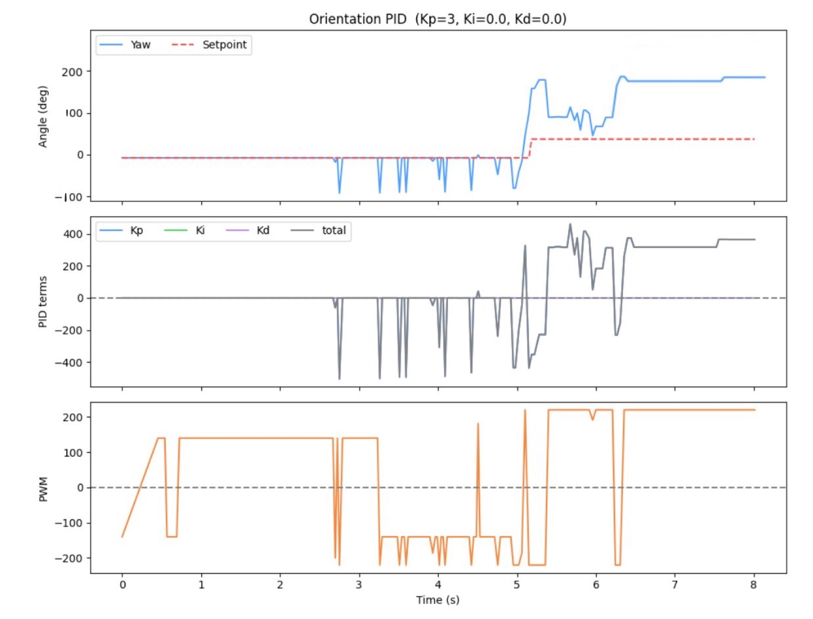
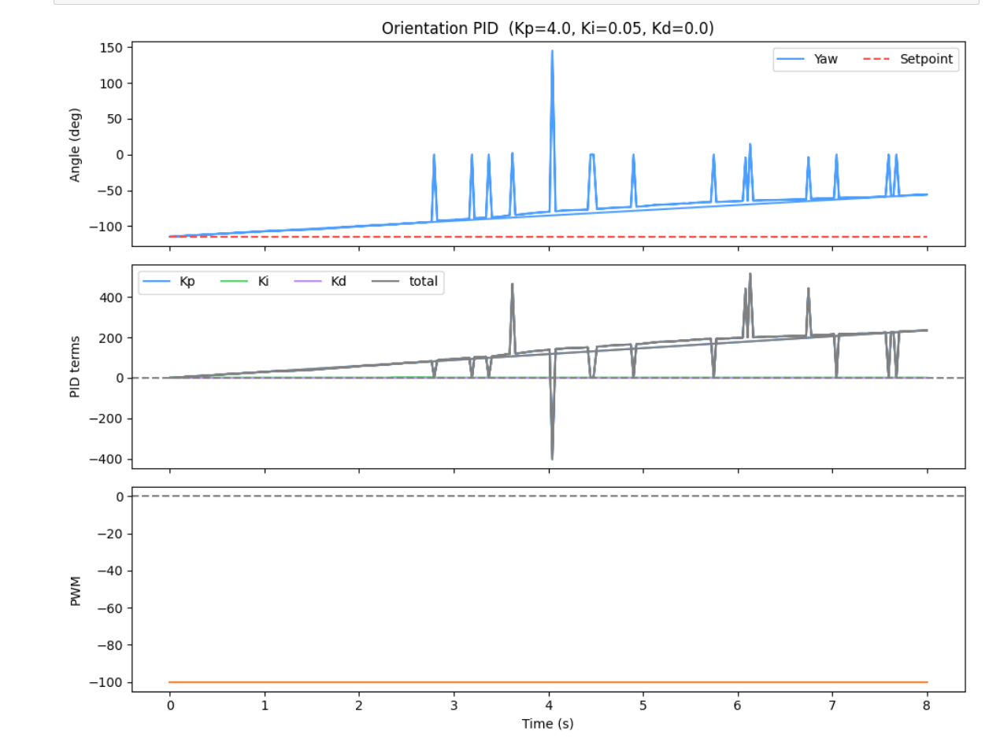
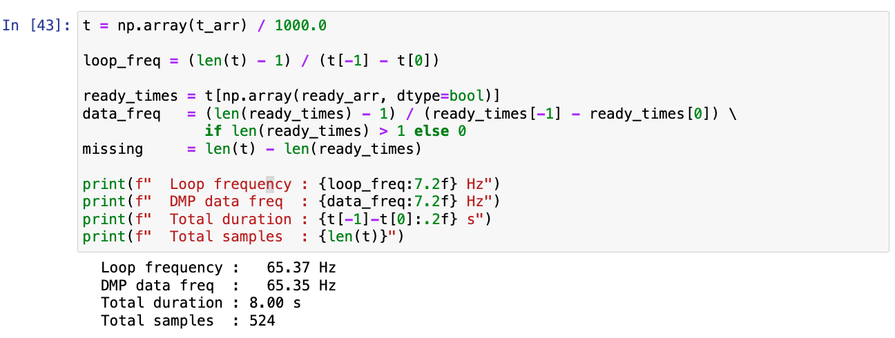
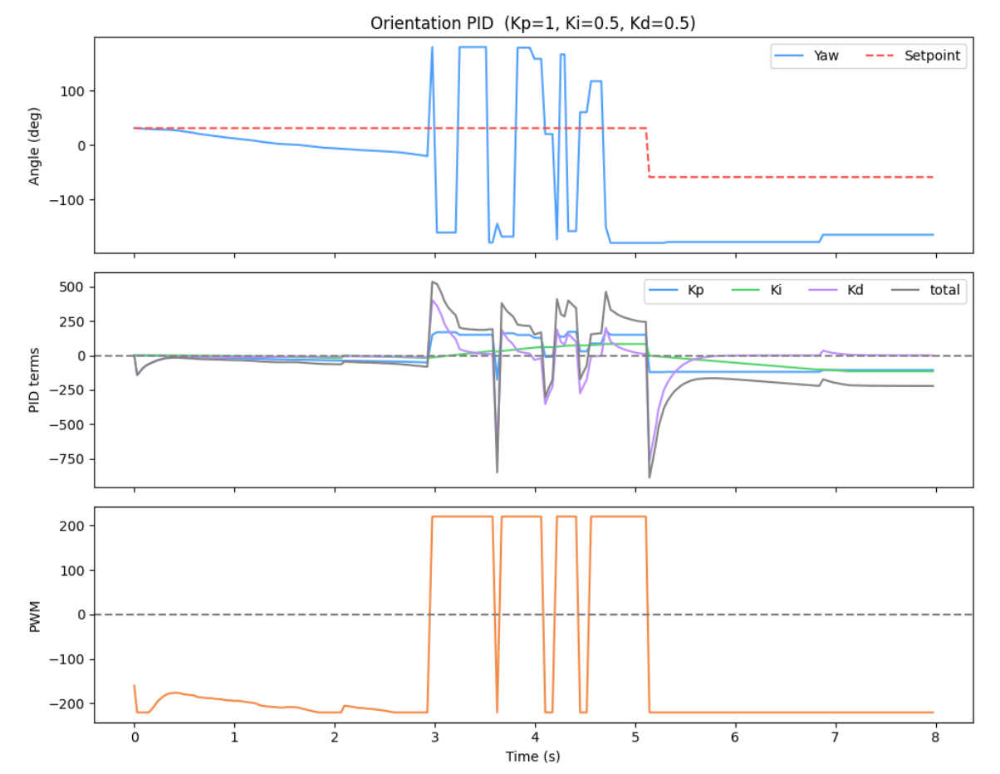
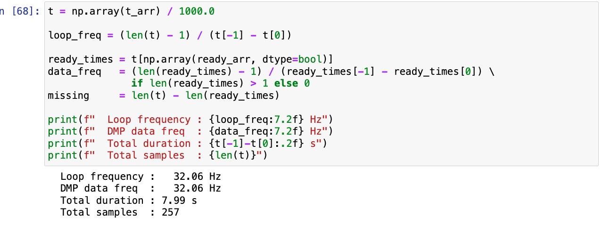

---
title: Lab 6
description: Orientation Control
pubDate: 2026-03-18
---
<article class="article">

## Prelab
Similar to my linear PID implementation, I added commands to start and receive the data and to set the parameters:

```c
enum CommandTypes
{
    ...
    // --- ORIENTATION PID ---
    START_ORIENT_PID,
    SEND_ORIENT_PID_DATA,
    SET_ORIENT_GAINS,
    SET_YAW_SETPOINT
};
```


```c
// in handle_command()
case START_ORIENT_PID:
  orient_idx             = 0;
  orient_pid_running     = true;
  orient_pid_start_time  = millis();
  orient_integral        = 0;
  orient_prev_error      = 0;
  orient_first_pid       = true;
  orient_last_t          = 0;
  yaw_setpoint           = yaw_dmp;
  break;


case SEND_ORIENT_PID_DATA:
  for (int i = 0; i < orient_idx; i++) {
    tx_estring_value.clear();
    tx_estring_value.append(orient_time_arr[i]);  tx_estring_value.append(",");
    tx_estring_value.append(orient_yaw_arr[i]);   tx_estring_value.append(",");
    tx_estring_value.append(orient_sp_arr[i]);    tx_estring_value.append(",");
    tx_estring_value.append(orient_kp_arr[i]);    tx_estring_value.append(",");
    tx_estring_value.append(orient_ki_arr[i]);    tx_estring_value.append(",");
    tx_estring_value.append(orient_kd_arr[i]);    tx_estring_value.append(",");
    tx_estring_value.append(orient_total_arr[i]); tx_estring_value.append(",");
    tx_estring_value.append(orient_pwm_arr[i]);
    tx_characteristic_string.writeValue(tx_estring_value.c_str());
    delay(20);
  }
  break;
```


```c
void spinRight(int spd) {
    analogWrite(MOTOR1_PIN1, spd);
    analogWrite(MOTOR1_PIN2, 0);
    analogWrite(MOTOR2_PIN1, calibrateRight(spd));
    analogWrite(MOTOR2_PIN2, 0);
}

void spinLeft(int spd) {
    analogWrite(MOTOR1_PIN1, 0);
    analogWrite(MOTOR1_PIN2, spd);
    analogWrite(MOTOR2_PIN1, 0);
    analogWrite(MOTOR2_PIN2, calibrateRight(spd));
}

int scaleToOrientPWM(float pid_output) {
    int sign = (pid_output > 0) ? 1 : -1;
    int pwm  = ORIENT_DEADBAND + (int)abs(pid_output);
    return sign * constrain(pwm, 0, ORIENT_MAX_PWM);
}

```

## PID Input Signal & Setup


Are there limitations on the sensor itself to be aware of? What is the maximum rotational velocity that the gyroscope can read (look at spec sheets and code documentation on github). Is this sufficient for our applications, and is there was to configure this parameter?

`The ICM-20948 gyroscope has a configurable full-scale range. The default in the SparkFun library is ±250°/s, but it can be set to ±500, ±1000, or ±2000°/s. For slow, controlled turns this is fine, but during a fast stunt the robot can easily exceed 250°/s — at that point the sensor saturates and the integrated yaw becomes irreparably wrong. For aggressive maneuvers, setting the range to ±2000°/s is advisable, at the cost of slightly lower resolution. In the SparkFun library this is configured via myICM.setFullScale(...).`


I integrated the gyroscope to get an estimate for the orientation of the robot. Yaw is obtained by numerically integrating the gyroscope's z-axis angular velocity over time: yaw += gyrZ * dt. This gives a continuously updated angle estimate between IMU readings but any small constant bias in the sensor reading accumulates unboundedly and numerical rounding errors. 

To reduce this bias, I used the onboard digital motion processor (DMP) built into your IMU to minimize yaw drift.


### Digital Motion Processing

Using the built-in Digital Motion Processing (DMP) that enables error and drift correction takes into account drift. Raw gyro integration accumulates drift (a few deg/sec). The DMP's onboard sensor fusion (game rotation vector / Quat6) uses a complementary filter internally giving drift-corrected quaternions, which is especially useful for yaw.

I followed the directions found in the  to enable DMP. In particular, I uncommented 

```c
#define ICM_20948_USE_DMP
```

in `~/Documents/Arduino/libraries/SparkFun_9DoF_IMU_Breakout_-_ICM_20948_-_Arduino_Library/src/util/ICM_20948_C.h`.

Since we are using one IMU (ADR jumper open), the default value of 1 is used for `#define AD0_VAL 1`. I decided to graphically visualize the DMP output by cloning the [3D visualization repo](https://github.com/synthghost/quaternion_sensor_3d_nodejs) and then editing file index.js to set the SERIAL_PORT and SERIAL_BAUD to mine. 

Then, in `/Example7_DMP_Quat6_EulerAngles.ino`, I uncommented `#define QUAT_ANIMATION ` and burned the sketch into the Artemis and ran the demo `node index.js`.

[](https://www.youtube.com/watch?v=tI-x966E26A)

I then had to integrate the Euler angles for the various orientations of the IMU accessed through DMP into my existing Arduino code and extract yaw by converting (q0,q1,q2,q3) with atan2(...).

```c
if ((myICM.status == ICM_20948_Stat_Ok) || (myICM.status == ICM_20948_Stat_FIFOMoreDataAvail)) {
  if ((data.header & DMP_header_bitmap_Quat6) > 0) {
    double q1 = ((double)data.Quat6.Data.Q1) / 1073741824.0; // Convert to double. Divide by 2^30
    double q2 = ((double)data.Quat6.Data.Q2) / 1073741824.0; // Convert to double. Divide by 2^30
    double q3 = ((double)data.Quat6.Data.Q3) / 1073741824.0; // Convert to double. Divide by 2^30

    double q0 = sqrt(1.0 - (q1*q1 + q2*q2 + q3*q3));

    // yaw (z-axis) from quaternion
    double yaw_rad = atan2(2.0*(q0*q3 + q1*q2), 1.0 - 2.0*(q2*q2 + q3*q3));
```


To note, because the sensor data is sent through a FIFO queue, the oldest data is sent over the I2C first. In order to get the latest data, we have to empty the queue out. However, if read too slowly, the DMP queue can fill up since the DMP processor can generate data much faster. To prevent overloadingm the chip with the DMP readings, I combined both reading the data as fast as possible (only have a delay between readings if no more data is available) slow down the DMP. 

[](https://www.youtube.com/watch?v=T2pCQMsuuW4)


### Derivative Term
To take into account derivative kick (a large, undesirable spike in the output of a PID controller) which happens because the derivative term acts on the instantaneous, massive change in error caused by sudden changes to the setpoint, the fix implemented for this is derivative on measurement. Rather than feeding the gyro z-axis reading directly, the derivative term is computed by finite-differencing the yaw error:

`d_raw = (error - prev_error) / dt`

Because the setpoint is held constant between steps, this is equivalent to 
differentiating the measurement directly (derivative on measurement). The practical 
effect is that a sudden setpoint change does not cause a derivative spike, since the 
setpoint cancels out of the difference. A lowpass filter is applied before the derivative term because finite differences amplify noise in the DMP output. Without filtering, the derivative term is dominated by noise and causes rapid motor chatter. In my code:

```d_filtered = ORIENT_D_ALPHA * d_raw + (1 - ORIENT_D_ALPHA) * d_filtered```

A small ORIENT_D_ALPHA gives heavy smoothing while larger values let more of the raw derivative through. This is tuned alongside Kd.


## Programming Implementation
The code is built in such a way that I can continue sending an processing Bluetooth commands while my controller is running. I have gain updates (SET_ORIENT_GAINS) and setpoint changes (SET_YAW_SETPOINT) where magnitude (how much to turn) is sent. Notably, when the setpoint is updated, the integral is reset to zero to prevent the accumulated error from the previous setpoint target from inappropriately influencing the response to the new one to avoid a large initial kick.

```C
case SET_ORIENT_GAINS: {
  float kp_new, ki_new, kd_new;
  robot_cmd.get_next_value(kp_new);
  robot_cmd.get_next_value(ki_new);
  robot_cmd.get_next_value(kd_new);
  orient_Kp = kp_new;
  orient_Ki = ki_new;
  orient_Kd = kd_new;
  break;
}

case SET_YAW_SETPOINT: {
  float delta;
  robot_cmd.get_next_value(delta);
  
  if (yaw_setpoint > 0) {
      yaw_setpoint = yaw_setpoint - delta;
  } else {
      yaw_setpoint = yaw_setpoint + delta;
  }
  orient_integral = 0;  // reset integral on setpoint change
  break;
}
                    


```


Furthermore, although controlling the orientation while the robot is driving forward or backward is not required for this lab, I would replace the `spinLeft`/`spinRight` functions that drive wheels in opposite directions at equal speed (with the calibration function I created previously due to uneven wheel spin rates) for pure rotation in:
```c
if (pwm > 0) {
    spinRight(pwm);
} else if (pwm < 0) {
    spinLeft(-pwm);
} else {
    stopMotors();
}
```
with a `differentialDrive(base_speed, pwm)` where the left/right wheel PWMs are computed as base_speed + pwm and base_speed - pwm. The base speed drives both wheels equally forward, while the PID output is added to one wheel and subtracted from the other to speed up one side and slowing down the other to produce a curve. 


To develop the orientation PID controller, I start with the proportional term, building step-by-step as I did in the linear PID lab 5. The implementation/code is nearly identical, with a few adjustments. 


### P Controller
I started with the proportional term and set the gains of the other terms to 0.
```c
float kp_term = orient_Kp * error;

...
float total = kp_term + ki_term + kd_term;
int pwm = scaleToOrientPWM(total);


if (pwm > 0) {
    spinRight(pwm);
} else if (pwm < 0) {
    spinLeft(-pwm);
} else {
    stopMotors();
}

```


[](https://www.youtube.com/watch?v=fQyPztiBi1w)


### PI Controller

```c
if (!saturated) {
      orient_integral += error * dt;
}
float ki_term = orient_Ki * orient_integral;
```



[](https://www.youtube.com/watch?v=4yxIpxXcAzY)


### PID Controller

```c
float kd_term = 0;
if (!orient_first_pid && dt > 0) {

    float d_raw = (error - orient_prev_error) / dt;
    orient_d_filtered = ORIENT_D_ALPHA * d_raw + (1.0f - ORIENT_D_ALPHA) * orient_d_filtered;
    kd_term = orient_Kd * orient_d_filtered;
}
orient_prev_error = error;
orient_first_pid  = false;

```



[](https://www.youtube.com/watch?v=Qq0Dxbd8Src)


### Range/Sampling Time

I tried discovering if there existed a limiting factor during each run (sampling frequencies shown previously). In my orientation PID controller loop rate, there was no limiting factor on how often new data was readily available as the DMP data that was ready frequency was the nearly as the loop frequency. Thus, unlike the ToF sensors in Lab 5 where we needed to extrapolate distance between readings to maintain a fast control loop, the DMP is capable of keeping up with the loop entirely on its own, meaning no interpolation scheme is needed and every control update acts on real measured data rather than an estimate.


## (5000) Wind-up implementation and discussion
Integrator windup occurs when the motor output is already saturated but the error has not yet reached zero, causing the integral term to keep accumulating unboundedly. When the robot finally approaches the setpoint, the integral term produces a large overshoot because it must be "unwound" before the output can reverse direction. This is especially problematic for orientation control across different floor surfaces since on a slippery surface the robot reaches the setpoint quickly, but on carpet the same PWM produces less rotation due to the friction. This means the robot spends more time at max output and the integral accumulates far more. Without windup protection, the same gains would produce wildly different overshoot behavior depending on the surface. To prevent this, integration is paused whenever the output is saturated and the error would push it further in the same direction.

This helps keep behavior consistent across floor surfaces.

[](https://www.youtube.com/watch?v=ScaXJXPCemY)