<article class="article">

## Step 1: Estimate drag and momentum
To build the state-space model, I needed to estimate two lumped physical parameters for the car: drag (d) and momentum (m). These come from a step-response experiment: I drove the car at a constant motor input toward the wall while logging ToF distance and computing velocity.

### State-Space Model
The car's 1D dynamics along the wall-approach axis can be written as (from [Lecture 13 Slide 30](https://fastrobotscornell.github.io/FastRobots-2026/lectures/FastRobots2026_Lecture13_Observability.pdf)):

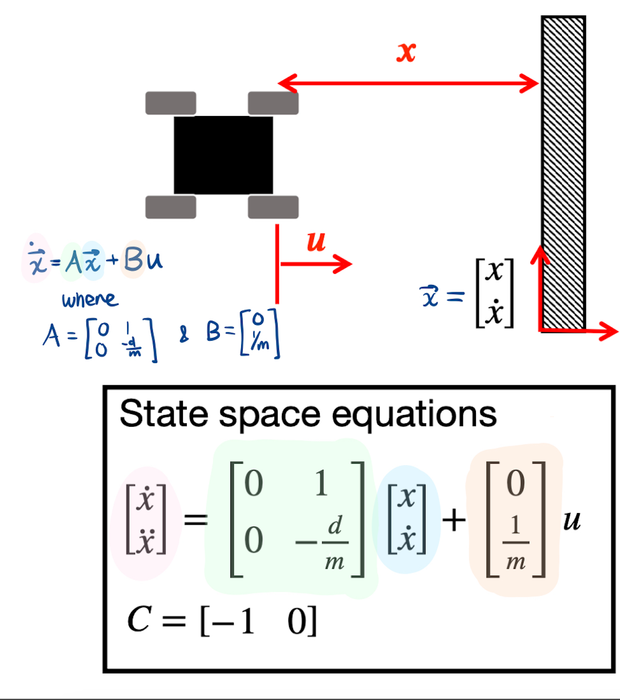


I used a step response by driving the car towards a wall at a constant imput motor speed while logging motor input values and ToF sensor output. The step responce, u(t), I chose was 150 PWM, as found in my Lab 5 (max speed video). I sent my `TOF_DATA` BLE command, logging time, distance, velocity, and PWM at every ToF reading.

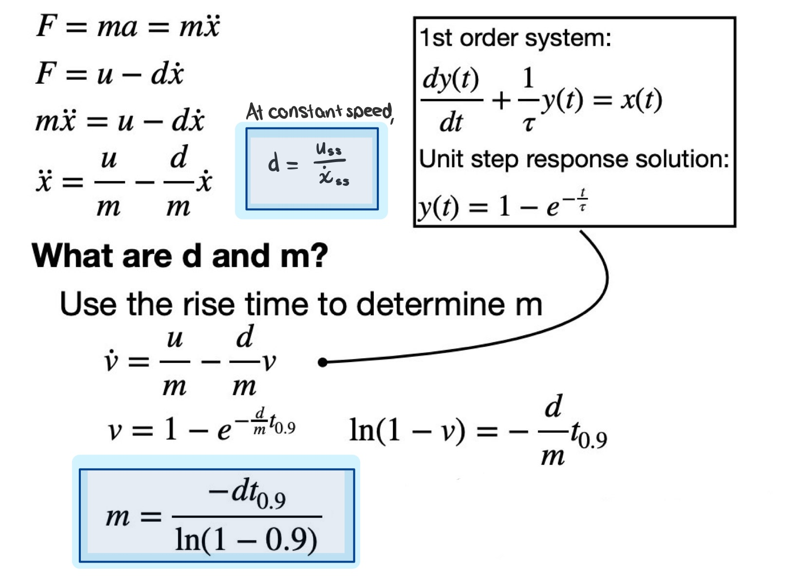

The physics model says velocity follows this shape when a constant input is applied: $v(t) = v_ss * e^{-d/m * t} $. That is, the velocity starts at 0 and asymptotes to v_ss (steady state, where acceleration is 0). 

The three plots (PWM, ToF distance, velocity vs. time in seconds) show the robot accelerating toward the wall. I included the trials while I tried to find the correct distance to reach a steady-state speed.
---

For 1500mm,
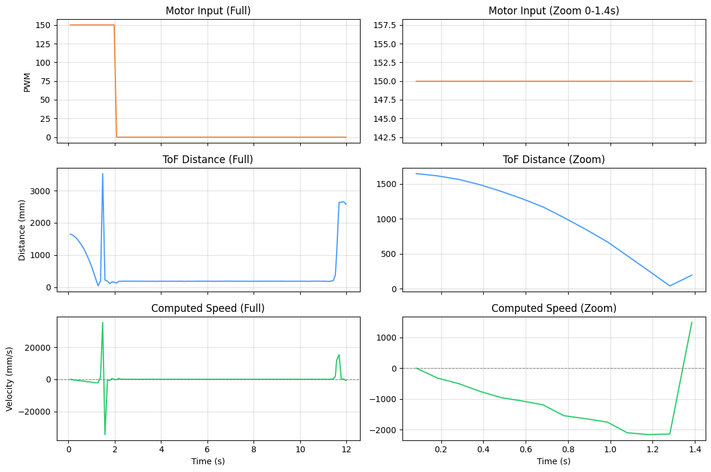
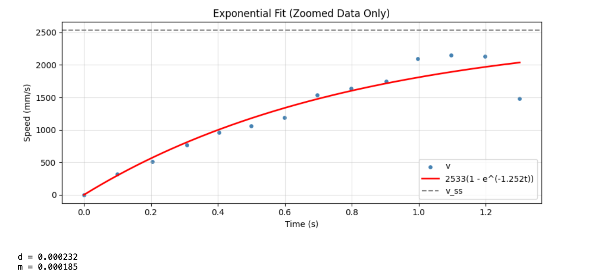

For such a short distance, the plots above demonstrates the car starting at approximately 1500mm away and then speeding towards my backpack (cushion), reaching it within 1.75 seconds. The first peak is simply the car flipping over (ToF pointing to the sky) and then getting obstructed by its own construction. Second peak is me walking over and picking it up. For analysis purposes, only the portion before the car slammed into the cushion is focused on. 

Since this distance was too short, I incrementally tested out a few distances until a steady-state was reached: 1500mm, 2000mm, 3000mm. 

[](https://www.youtube.com/watch?v=2tQ7awG9hFw)

---
For 2000mm,
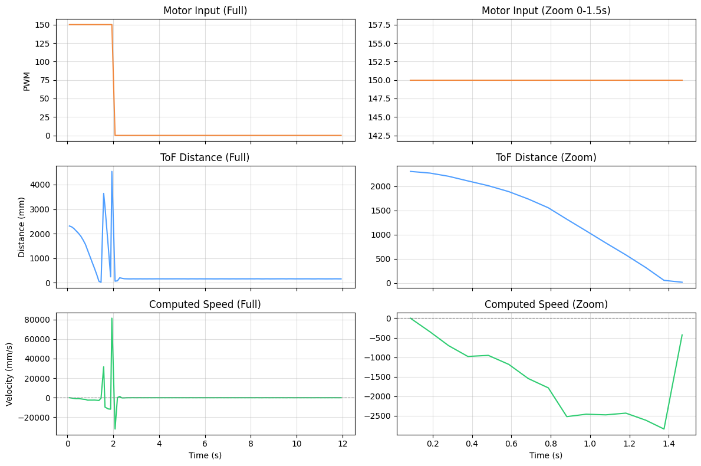
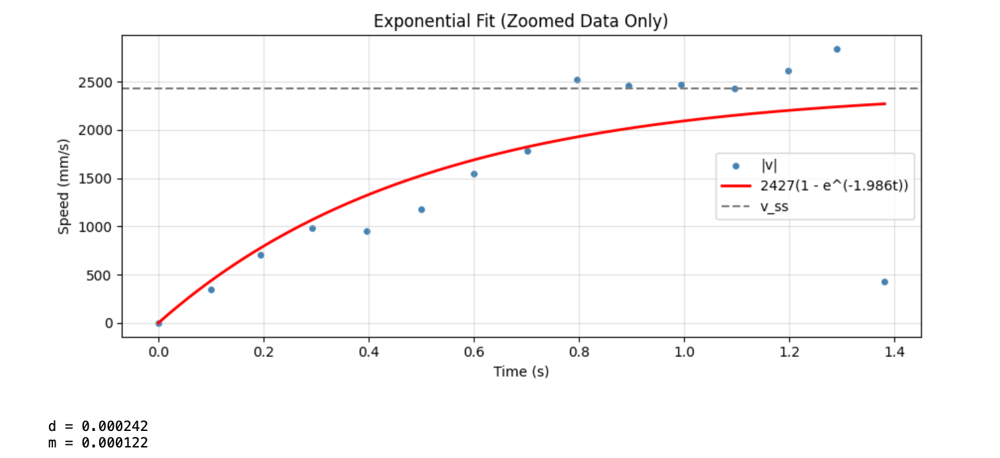
---
For 3000mm,
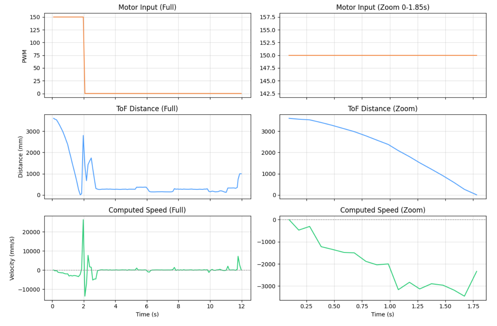
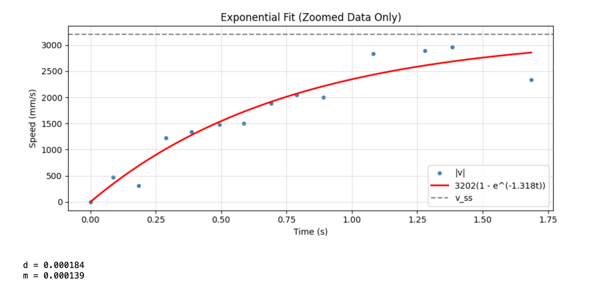

---
For 4000mm,
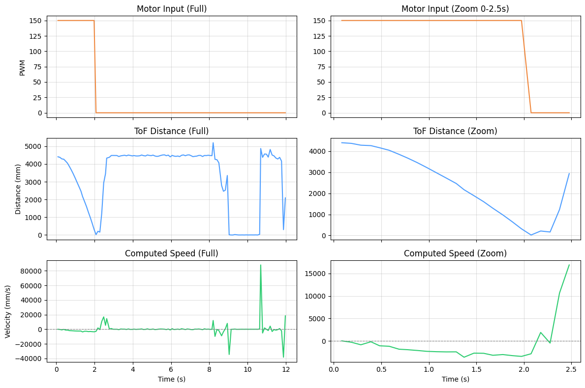
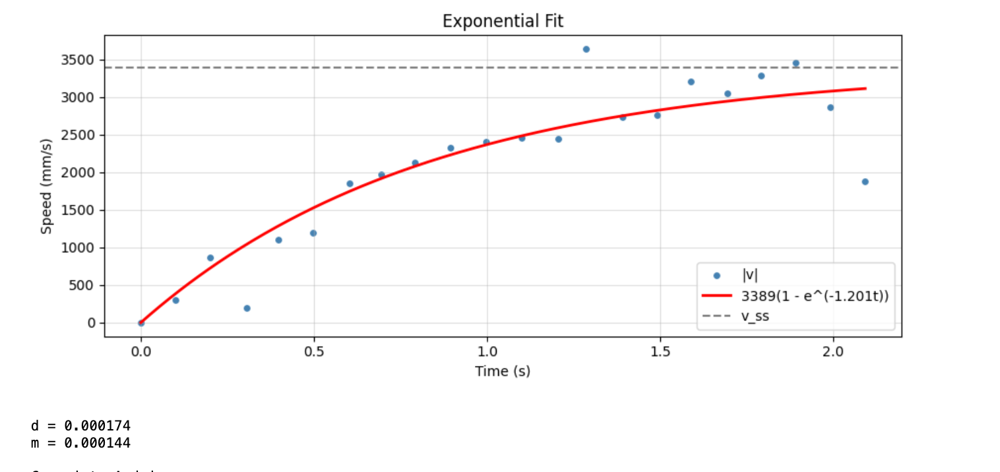

Using the distance found by the ToF, I found the exponential fit to find the steady state.

```python
def velocity_model(t, v_ss, decay):
    return v_ss * (1 - np.exp(-decay * t))

try:
    params, _ = curve_fit(velocity_model, t_clean, v_clean, p0=[3202.0, 1.3], maxfev=10000)
    v_ss_fit, decay_fit = params
except Exception as e:
    print(f"Fit failed: {e}")
```

From the resulting final plots:
- Steady-state speed (v_ss): approximately 3389 mm/s
- 90% rise time speed (v_90): 3050 mm/s
- 90% rise time (t_90): approximately 1.9 s
- Normalized u: 150 / 255 = 0.588
- d = 0.000174 and m = 0.000144
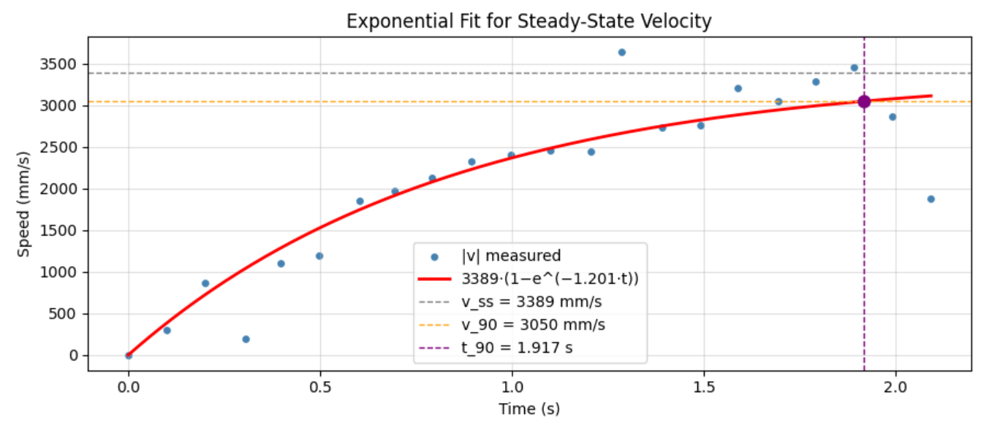


## Initialize Kalman Filter (KF)
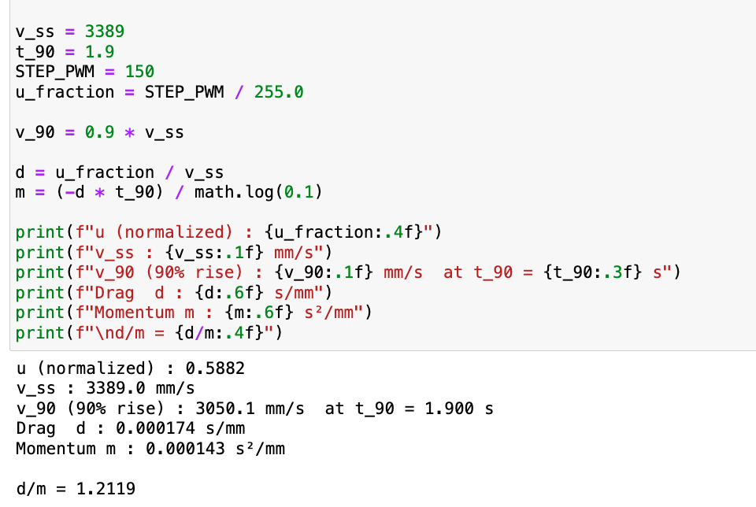

The A and B matrices are as follows: 
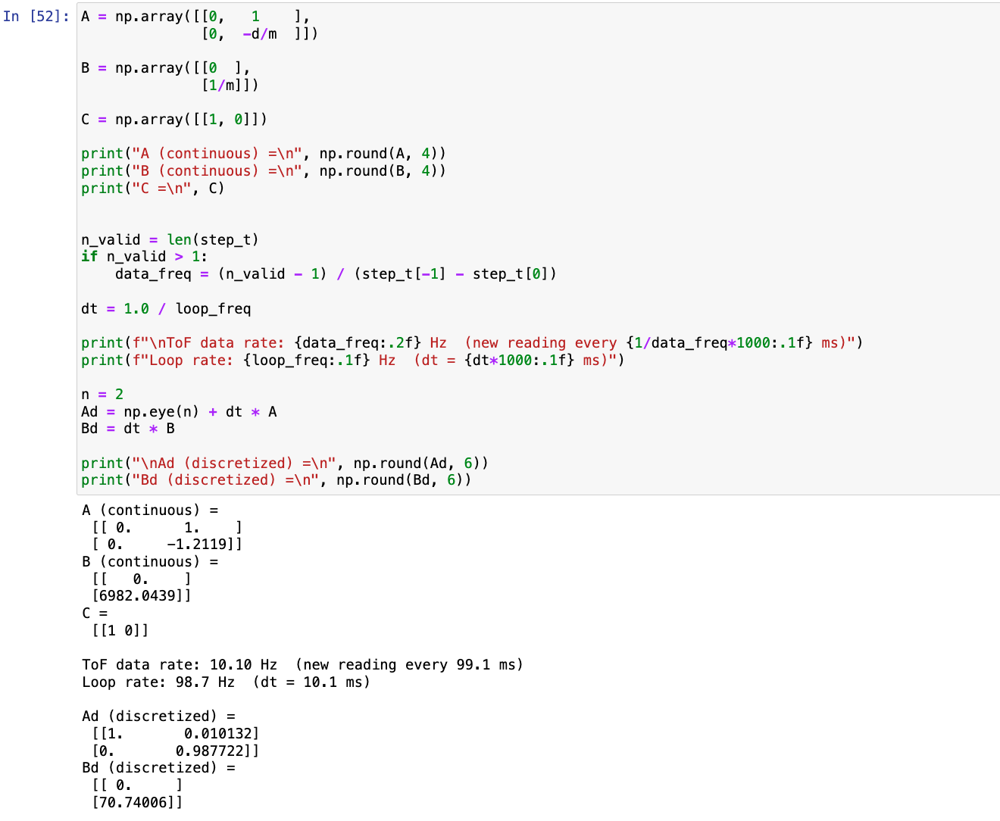
To discretize the A and B matrices, I found the sampling rate of our ToF sensor, similar to previous labs. I discretized at the PID control loop rate (dt = 0.01 s) because the Kalman Filter runs a prediction every loop iteration and only does a measurement update when a new ToF reading arrives.

Now, process and measurement noise needs to be accounted for. 

### Noise Covariance Matrices
Process noise ($\Sigma$ u) captures uncertainty in the model. I scaled it by the data frequency following the approach from lecture:
```python
sigma_pos = math.sqrt(100 * data_freq)
sigma_vel = math.sqrt(100 * data_freq)

Sigma_u = np.array([ [sigma_pos**2, 0], [0, sigma_vel**2] ])
sigma_init = np.array([ [20.0**2, 0], [0, 1.0 ] ])
``` 

Measurement noise ($\Sigma$ z) captures ToF sensor uncertainty. The VL53L1X datasheet specifies +=20 mm accuracy at long range, so I started there:
```python
sigma_meas = 20.0   # in mm
Sigma_z = np.array([[sigma_meas**2]])
```

To check the logic, I applied the KF on the step response before implementing further. 
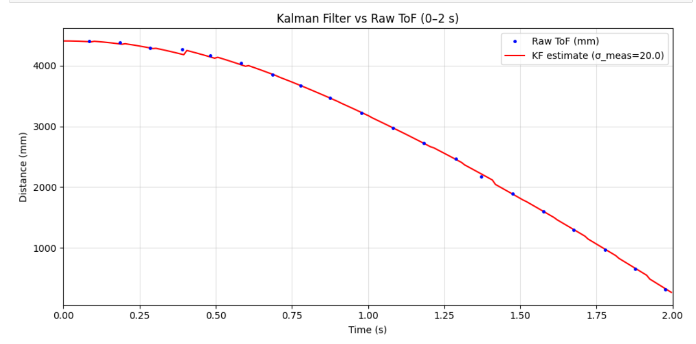
If `sigma_meas` is small (like 5), the filter trusts the sensor heavily and follows noisy ToF readings closely. If `sigma_meas` is large (like 80), the filter trusts the model and interpolates smoothly between readings but may lag real motion. The plots in the next section show this trade-off.


## Implement KF in Python

Adjusting the provided Python function
```python
def kf(mu, sigma, u, y, data_ready=True):
    # PREDICTION (runs every loop iteration)
    mu_p = Ad.dot(mu) + Bd.dot([[u]])
    sigma_p = Ad.dot(sigma.dot(Ad.T)) + Sigma_u

    if not data_ready:
        return mu_p, sigma_p

    # UPDATE only when new ToF reading is available
    sigma_m = C.dot(sigma_p.dot(C.T)) + Sigma_z
    K = sigma_p.dot(C.T.dot(np.linalg.inv(sigma_m))) # Kalman gain
    y_m = np.array([[y]]) - C.dot(mu_p) # innovation
    mu = mu_p + K.dot(y_m)
    sigma = (np.eye(2) - K.dot(C)).dot(sigma_p)
    return mu, sigma
```

The data_ready flag makes it so when no new ToF measurement has arrived, the filter skips the update step and returns only the prediction. This is what allows the filter to run at 100 Hz while the sensor only provides data at 10 Hz.

### Testing on Step Response Data
I looped through the step response data at the finer 100 Hz time grid, calling the filter with `data_ready=True` only when a new ToF reading was available. The control input `u` was set to -u_fraction while the motor was running (negative because the robot approaches the wall, decreasing distance) and 0 when stopped.

The resulting plot shows the KF estimate smoothly interpolating between sparse ToF measurements for different covariance. I included the (discontinious) data around 2.3-2.6s when the robot flipped to show a rapid change and demonstrate lag for model-trusting values.
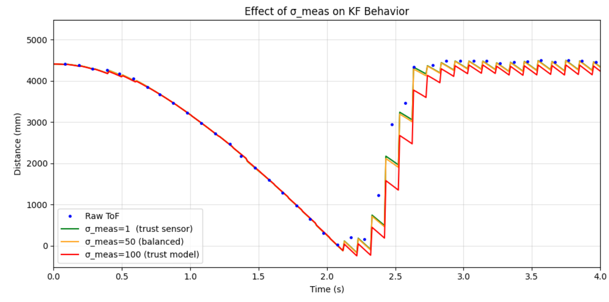

### Comparison
| Setting | σ_meas (mm)| Behavior | Description |
|---------------|------------|----------------------------------|--------------------------|
| Smooth (trust model) | 80 mm | Smooth, ignores sensor jitter | Strong reliance on model, may lag real position |
| Balanced | 20 mm | Good mix & follows trend | Balanced performance |
| Trust sensor | 5 mm | Hugs raw ToF data | Sensitive to noise, captures rapid changes but amplifies noise |

While measurement noise (σ_meas) controls how much the filter trusts sensor data, process noise (σ_process) determines how flexible the model is. If σ_process is too small, the filter becomes overconfident in its predictions. On the other hand, a high process noise means it is more responsive but less stable.
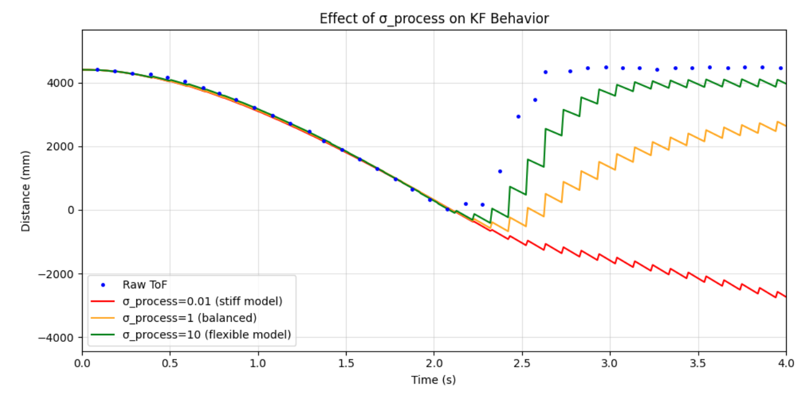

## Implement KF on the Car


From the python results, I set my parameters to
```c
const float KF_D  = 0.000174;
const float KF_M  = 0.000144;
```

I call the following in `setup()`:
```c
void kf_init() {
    float d  = KF_D;
    float m  = KF_M;
    float dt = KF_DT;

    // Ad = I + dt * [[0,1],[0,-d/m]]
    Ad00 = 1.0f;
    Ad01 = dt;
    Ad10 = 0.0f;
    Ad11 = 1.0f - dt * (d / m);

    // Bd = dt * [[0],[1/m]]
    Bd0 = 0.0f;
    Bd1 = dt / m;

    // reset
    kf_x0 = 0.0f;  kf_x1 = 0.0f;

    // reset covariance to initial uncertainty
    kf_p00 = 400.0f;
    kf_p01 = 0.0f;
    kf_p10 = 0.0f;
    kf_p11 = 1.0f;

    kf_initialized = false;
}
```

My update is
```c

float kf_update(bool data_ready, float u, float tof_mm) {
    if (!kf_initialized) {
        if (data_ready) {
            kf_x0 = tof_mm;
            kf_x1 = 0.0f;
            kf_initialized = true;
        }
        return tof_mm;
    }

    // predict
    float xp0 = Ad00*kf_x0 + Ad01*kf_x1 + Bd0*u;
    float xp1 = Ad10*kf_x0 + Ad11*kf_x1 + Bd1*u;

    float tmp00 = Ad00*kf_p00 + Ad01*kf_p10;
    float tmp01 = Ad00*kf_p01 + Ad01*kf_p11;
    float tmp10 = Ad10*kf_p00 + Ad11*kf_p10;
    float tmp11 = Ad10*kf_p01 + Ad11*kf_p11;

    float pp00 = tmp00*Ad00 + tmp01*Ad01 + kf_su0;
    float pp01 = tmp00*Ad10 + tmp01*Ad11;
    float pp10 = tmp10*Ad00 + tmp11*Ad01;
    float pp11 = tmp10*Ad10 + tmp11*Ad11 + kf_su1;

    if (!data_ready) {
        kf_x0 = xp0;  kf_x1 = xp1;
        kf_p00 = pp00; kf_p01 = pp01;
        kf_p10 = pp10; kf_p11 = pp11;
        return kf_x0;
    }

    float s_m = pp00 + kf_sz;
    float k0  = pp00 / s_m; // gain for pos
    float k1  = pp10 / s_m; // gain for vel

    float innov = tof_mm - xp0;

    kf_x0 = xp0 + k0 * innov;
    kf_x1 = xp1 + k1 * innov;

    kf_p00 = (1.0f - k0) * pp00;
    kf_p01 = (1.0f - k0) * pp01;
    kf_p10 = pp10 - k1 * pp00;
    kf_p11 = pp11 - k1 * pp01;

    return kf_x0;
}

```
The linear extrapolation (`interp_distance()`)  from lab 5 was removed and replaced with the KF call:

```c

float u_normalized = 0.0f;
if (pid_idx > 0 && pid_pwm_arr[pid_idx-1] > 0) {
    u_normalized = -(float)pid_pwm_arr[pid_idx-1] / 150.0f;
}

// Run KF: returns estimated distance at full loop rate
float kf_dist = kf_update(data_ready, u_normalized, (float)curr_distance);
float pid_distance = kf_dist;   // use this for PID error calculation
```

### Details
The robot  reaches and holds the 304 mm setpoint with small oscillations. Linear extrapolation blindly projects the last measured velocity, which amplifies any measurement noise. The KF instead uses the physical model to predict future state, combining that prediction with new sensor data optimally. This means the PID loop can run faster than the sensor rate with accurate distance estimates at each step.

A large K means a new sensor reading strongly corrects the state (trust sensor); a small K means the filter relies on the model (trust model). Too much sensor trust makes the filter noisy, while too much model trust lets it drift from reality, especially under varying control inputs.

The normalized u fed to the filter should represent the true fraction of maximum input. I divided the PWM by the step-test PWM (150), so u = –1 at full drive and 0 at rest. Skipping the measurement update when no new ToF data is available prevents the filter from applying the same stale measurement twice, which would artificially drive the Kalman gain toward zero and cause the filter to go blind.

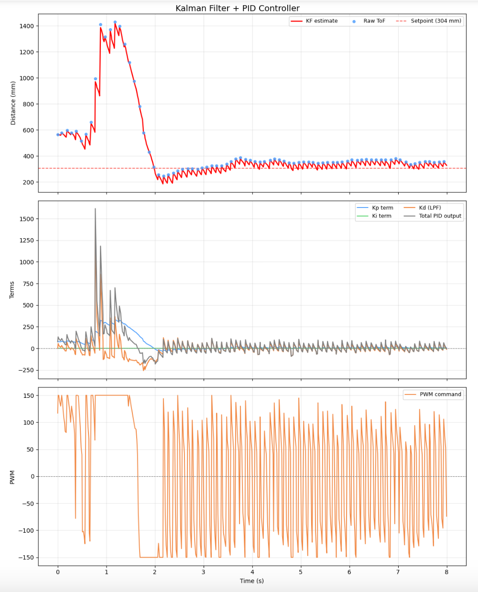

[](https://www.youtube.com/watch?v=240006YMbVM)

## Acknowledgements

I referenced the Aidan McNay and Trevor Dales's past lab report from from Spring 2025.

