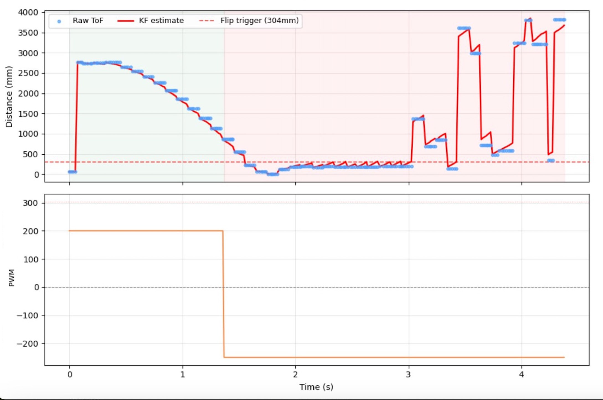
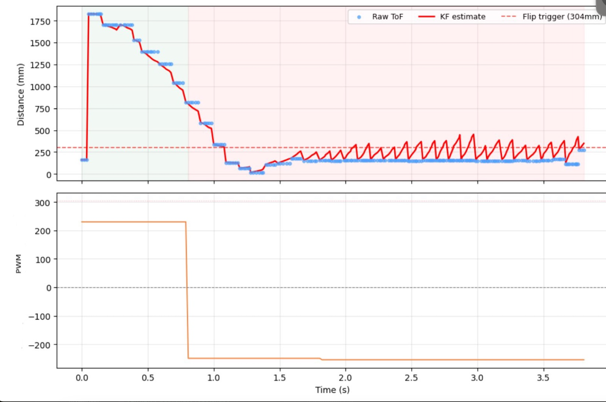
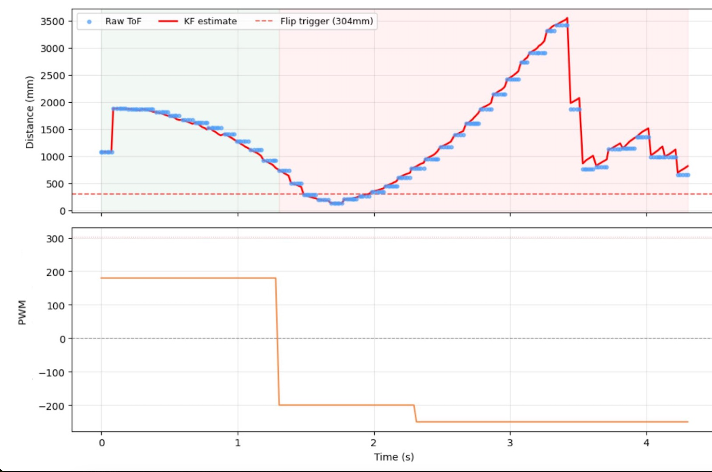
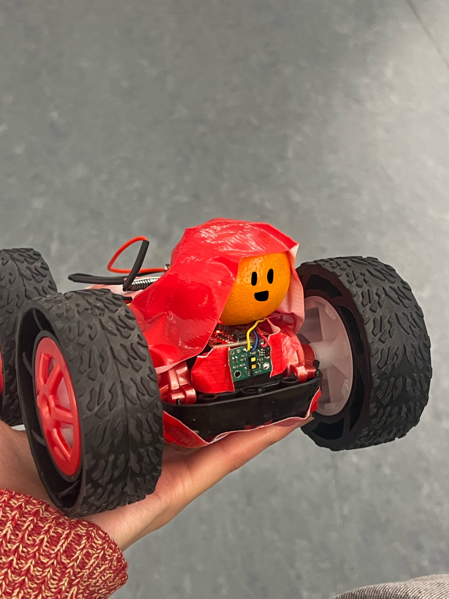

<article class="article">

I will perform a controlled flip stunt where the car drives fast toward a wall, flips, and returns past the start line.


## Implementation

The flip required adding weight to the front of the robot to shift the center of mass forward to make it easier for the reverse force to rotate the car over its front wheels. I added my backpack against the wall for padding.

I added new commands `START_FLIP` and `SEND_FLIP_DATA` to send the data over bluetooth.

```c
case START_FLIP:
    kf_init();
    stunt_idx   = 0;
    stunt_phase = STUNT_APPROACH;
    stunt_running = true;
    stunt_start_time = millis();
    distanceSensor2.startRanging();
    break;

```

Because the ToF sensor updates too slowy (shown in previous labs), the KF prediction step uses the motor input and dynamics model to estimate position between sensor readings.

I implemented Task A (flip) using different states: APPROACH, REVERSE, RETURN, and DONE. The robot drives forward fast from the start line. The Kalman Filter from Lab 7 runs continuously, providing a distance estimate at the full loop rate even between the slower ToF readings. Once the KF estimate drops below 304mm (1ft), the state transitions to REVERSE where both motors instantly switch to full reverse, and the momentum of the car combined with the sudden braking force causes it to flip forward. After a fixed STUNT_REVERSE_DUR of 1s, the robot transitions to RETURN and drives backward to cross back past the start line.

```c
loop() {
  ...
  if (stunt_running) {
      run_flip_step();
  }
  ...
}


void run_flip_step() {
    unsigned long now = millis();
    bool data_ready  = false;

    if (now - stunt_start_time > 5000) {
      stopMotors();
      stunt_running = false;
      stunt_phase = STUNT_DONE;
      return;
    }

    if (distanceSensor2.checkForDataReady()) {
      curr_distance = distanceSensor2.getDistance();
      distanceSensor2.clearInterrupt();
      data_ready = true;
    }

    float u_kf = 0.0f;
    if (stunt_phase == STUNT_APPROACH) {
      u_kf = -1.0f;
    }
    if (stunt_phase == STUNT_REVERSE) {
      u_kf = 1.0f;
    }
    if (stunt_phase == STUNT_RETURN) {
      u_kf = 1.0f;
    }

    float kf_dist = kf_update(data_ready, u_kf, (float)curr_distance);

    int pwm_log = 0;

    if (stunt_phase == STUNT_APPROACH) {
      forward(STUNT_APPROACH_PWM);
      pwm_log = STUNT_APPROACH_PWM;

      if (kf_initialized && kf_dist <= STUNT_FLIP_DIST) {
        stunt_phase = STUNT_REVERSE;
        stunt_phase_start = now;
      }
    }
    else if (stunt_phase == STUNT_REVERSE) {
      backward(STUNT_REVERSE_PWM);
      pwm_log = -STUNT_REVERSE_PWM;

      if (now - stunt_phase_start > STUNT_REVERSE_DUR) {
        stunt_phase = STUNT_RETURN;
        stunt_phase_start = now;
      }
    }
    else if (stunt_phase == STUNT_RETURN) {
      backward(STUNT_RETURN_PWM);
      pwm_log = -STUNT_RETURN_PWM;

      if (now - stunt_phase_start > STUNT_RETURN_DUR) {
        stopMotors();
        stunt_phase = STUNT_DONE;
        stunt_running = false;
      }
    }

    if (stunt_idx < MAX_STUNT_SAMPLES) {
      stunt_time_arr[stunt_idx] = (int)now;
      stunt_dist_arr[stunt_idx] = (float)curr_distance;
      stunt_kf_arr[stunt_idx] = kf_dist;
      stunt_pwm_arr[stunt_idx] = pwm_log;
      stunt_idx++;
    }
}


```

I tested out a few stunts after my initial implementation to see what needed improving. After running a few times, I achieved mostly successes where the robot successfully flipped and continued driving back to the start position. Therefore, I did not add PID control on the speed of the robot instead of the position nor PID control of the angle. The exceptions can be found in the blooper reel. 
---
## Examples

At varying designated lines (<4m from the wall), the car drives fast forward, and upon reaching the sticky mat with a center located 1ft from the wall, performs a flip, and drives back in the direction from which it came. It must re-cross the starting line.

I found that the ToF data after the flip was often noisy or inaccurate, perhaps due now the sensor's field of view hits the ground at close range. Right after landing from a flip, the car bounces or tilts slightly and at short distances, the small angular offset of the sensor causes it to read the ground instead of the distance in front of it.

### Flip 1
Although it collides into a chair, the robot successfully flips and recrosses the finish line.
[](https://www.youtube.com/watch?v=mND7YGmCU_Y)




### Flip 2
[](https://www.youtube.com/watch?v=JqWOYETOAGw)



### Flip 3
[](https://www.youtube.com/watch?v=QPFyLaQO1Uc)




## Bloopers! 

While figuring out what to use as my weight, I taped on a clementine (Mr. Clementine). He was unfortunately too big on top (had some good test runs where he caused the car to bounce like crazy; wish I recorded them) and not heavy enough to flip the car when I shoved him into the battery compartment on the bottom. Eventually I replaced him with another object. And then ate him. But he lives on in my heart (and stomach). 

I also had an extra clementine (his brother) and ate him too later on. Hope you enjoy my compilation of bloopers.

[](https://www.youtube.com/watch?v=FooTlUWiOCI)


## Acknowledgements
I referenced Aidan McNay's past lab report from from Spring 2025.

